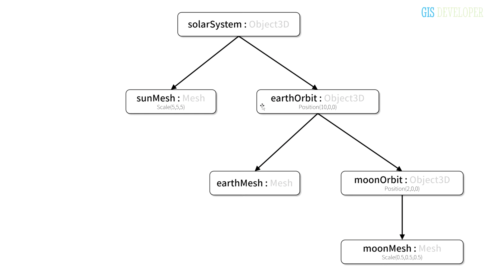
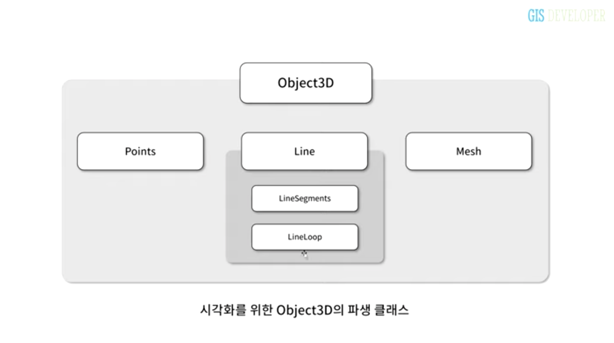
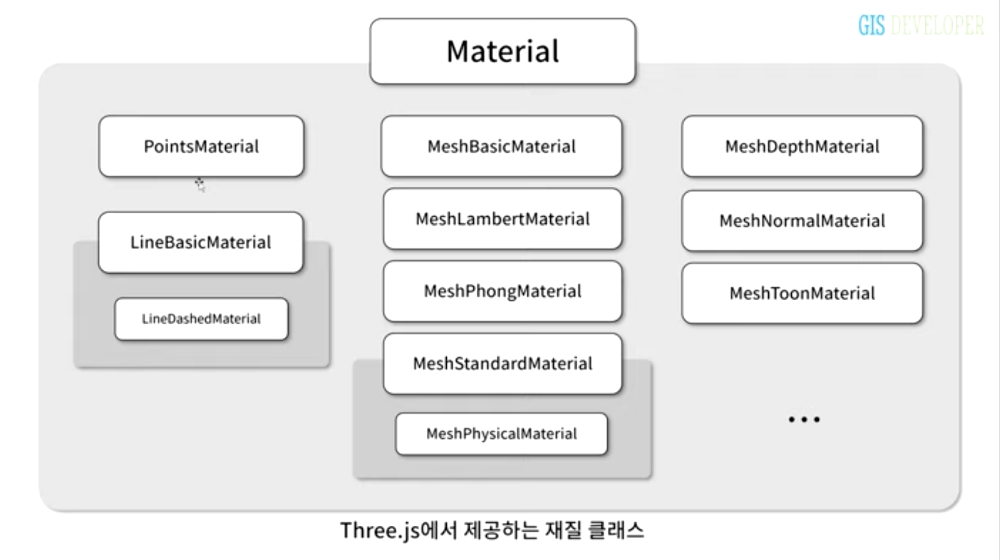
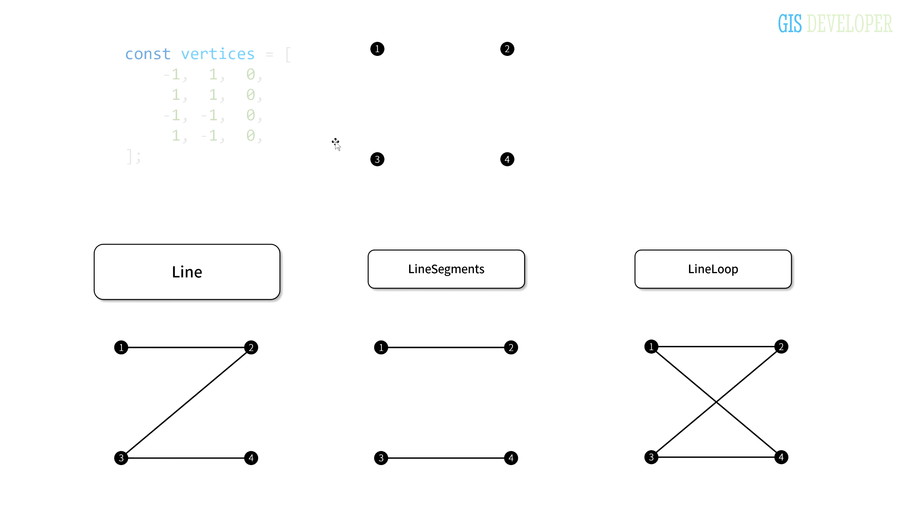
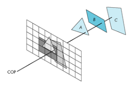
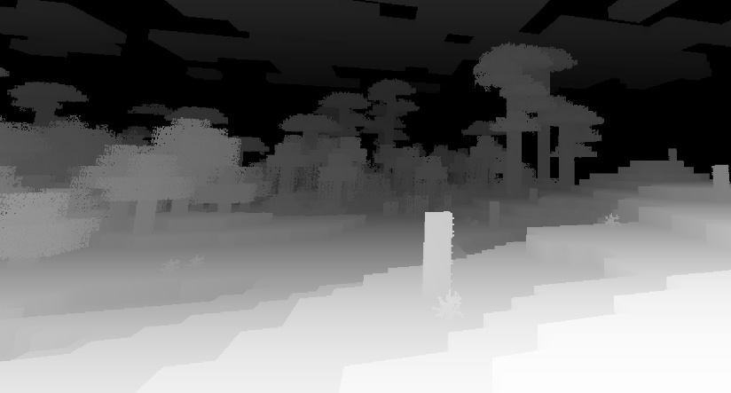
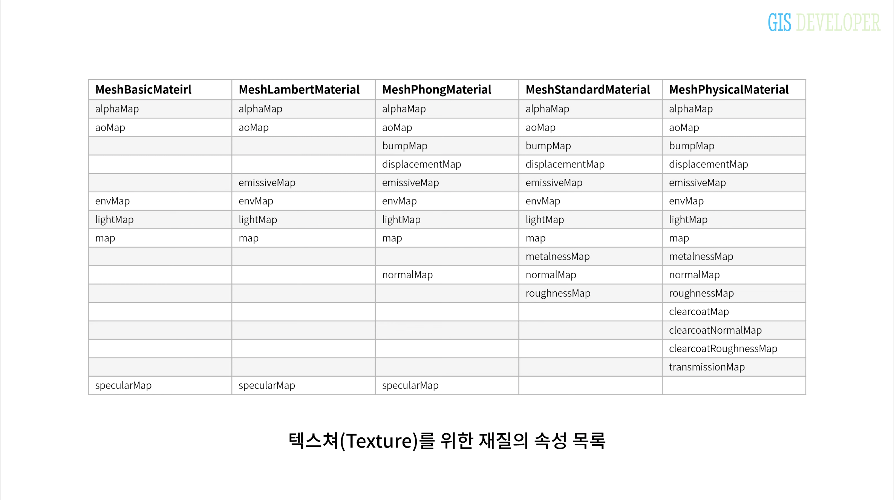
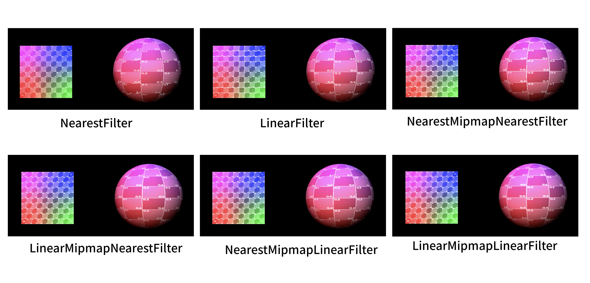

# Week2

## #4. 씬그래프

<aside>
✅ 챕터목표
- 씬그래프의 설계를 이해한다.
</aside>

### 씬그래프 구성하기


씬그래프를 구성하기 위해서, 오브젝트 구조의 전체 설계를 진행한다.
`THREE.Object3D();`로 선언한 Orbit 객체들 하위에 다시 오브젝트를 추가하고, 그 오브젝트 내부에 메시를 추가하면 오브젝트를 부모로하는 리프 노드들이 생성된다.
코드는 아래와 같다.

```tsx
  private _setupModel() {
    const solarSystem = new THREE.Object3D();
    this._scene.add(solarSystem);

    const radius = 1;
    const widthSegments = 12;
    const heightSegments = 12;
    const sphereGeometry = new THREE.SphereGeometry(radius, widthSegments, heightSegments);

    const sunMat = new THREE.MeshPhongMaterial({ emissive: 0xffff00, flatShading: true });
    const sunMesh = new THREE.Mesh(sphereGeometry, sunMat);
    sunMesh.scale.set(3, 3, 3);
    solarSystem.add(sunMesh);


    const earthOrbit = new THREE.Object3D();
    const earthMat = new THREE.MeshPhongMaterial({ color: 0x2233ff, emissive: 0x112244, flatShading: true });
    const earthMesh = new THREE.Mesh(sphereGeometry, earthMat);
    earthMesh.scale.set(1, 1, 1);
    earthOrbit.position.x = 10;
    earthOrbit.add(earthMesh);
    solarSystem.add(earthOrbit);

    const moonOrbit = new THREE.Object3D();
    const moonMat = new THREE.MeshPhongMaterial({ color: 0xffffff, flatShading: true });
    const moonMesh = new THREE.Mesh(sphereGeometry, moonMat);
    moonMesh.scale.set(0.5, 0.5, 0.5);
    moonMesh.position.x = 2;
    moonOrbit.add(moonMesh);

    this._solarSystem = solarSystem;
    this._earthOrbit = earthOrbit;
    this._moonOrbit = moonOrbit;
  }
```

여기서 유의해야할 점은, `solarSystem`을 class에 property로 선언해두고 써야한다는 점이다. 또한 constructor에서 초기화를 하지 않으면 안된다.
초기화 코드는 아래와 같이 작성했다.

```javascript
class App {
  private _divContainer: HTMLElement;
  private _renderer: THREE.WebGLRenderer;
  private _scene: THREE.Scene;
  private _camera!: THREE.PerspectiveCamera;
  private _solarSystem: THREE.Object3D<THREE.Event>;
  private _earthOrbit: THREE.Object3D<THREE.Event>;
  private _moonOrbit: THREE.Object3D<THREE.Event>;
  ....

  constructor() {
    ...
    const scene = new THREE.Scene();
    this._scene = scene;

    this._solarSystem = new THREE.Object3D();
    this._earthOrbit = new THREE.Object3D();
    this._moonOrbit = new THREE.Object3D();
    ...}

  ...
}
```

Object3D를 기준으로 하나의 그룹이 생성된다고 생각하면 편할 것 같다.
객체가 클래스 내부에 존재하는 걸 명시하자~

## #5.1 재질(Material)

Material은 Object3D를 생성하기 위한 필수 요소이다.


Object3D 내부에는 Points, Line, Mesh 클래스가 존재하고 이들 모두 Material을 상속받는 클래스이다.
<br/>

Material 클래스는 위와 같이 구성되어 있다.
Material에는 texture sprite image들을 이용해 texture를 설정할 수 있다.
여기서 알파값은 transparency(opacity)이며 alphatest를 통해 opacity의 조건을 걸어 antialias를 한다던지 등등 활용할 수 있을걸로 보인다.

##### 알파 테스트?


[참고링크](https://docs.unity3d.com/kr/2018.4/Manual/SL-AlphaTest.html)  
참고 링크 내용을 보면 게임에서 옛날엔 사물의 윤곽선을 더 뚜렷이 보이게 하기 위해 알파 테스트를 사용했던 것 같다.
첫번째가 알파테스트, 두번째가 알파블렌딩, 세번째가 알파블렌딩과 테스트의 결합체.
원근 구현과 함께 물체의 곡률과 입체감 블렌딩까지 적절히 조화된 것을 확인할 수 있다.
그러나 최근 게임엔진에선 이걸 다 구현해뒀기 때문에 그냥 셰이더를 쓰면 된다고 한다.

##### 라인 클래스의 옵션


하나의 vertices에 대해 `THREE.Line`, `THREE.LineSegments` , `THREE.LineLoop` 각각의 객체로 생성했을 때의 결과이다. 객체를 무엇으로 만드냐에 따라 오브젝트의 형태가 완전히 바뀌니까 조심해서 다루자. 이 Loop option이 응용되면 cap 옵션으로 확장되는 것이다.

## #5.2 재질(Material)

모든 재질은 material을 상속받아 그 속성을 사용할 수 있다.
`visible` : 메쉬의 visible 옵션을 지정한다. 인터랙션에 따른 visibility를 조정할 수 있다.

##### `DepthBuffer`

이 속성은 그래픽 렌더링에 있어 매우매우 중요한 속성이다.
z-buffer라고도 부르는 이 속성이 무슨 개념인지 알아보자. 영상에서는 이를 3차원 객체를 구성하는 픽셀의 z값을 정규화해 저장한 버퍼라했다.
<br/>

3차원 상에 우리는 `object.position.set(x,y,z)`으로 객체를 아주 다양하게 위치시킬 것이다. 그러나 그 값을 그대로 쓴다면 연산이 매우 커진다. 안그래도 연산이 복잡한 3d graphics에서 연산을 최적화하기 위해선 이런 수들을 정규화하거나 압축하는데, 간단하게 표현하면 위 이미지 처럼 A,B,C이미지의 좌표를 최소값~최대값 범위내에서 압축해버리는 것이다. 이건 jpg 압축 알고리즘과 비슷할 거라 생각한다


그래서 압축하고나면 대충 이런 depth buffer 이미지가 탄생한다.
위 이미지는 마인크래프트 셰이더에서 만들어낼 수 있는 z-buffer image인데, 이제 저 z-buffer값에 컬러를 입히면 입체감이 만들어지게 된다~
<br/>

##### MeshPhysicalMaterial

가장 현실적인 렌더링과 관련한 메테리얼이다.
`clearcoat` : 0~1 코딩에 대한 값으로 1이 최대. rough, metal 값과 관계없이 반사광을 얻어낼 수 있음
`cleatcoadRoughness` : 코딩에 대한 금속 성질

## 5.3 재질 textures


map은 모든 메테리얼에 적용 가능하다.
texture mapping 중에 Filter에 대해 더 알아보자

     texture.magFilter = THREE.LinearFilter;
     texture.minFilter = THREE.NearestMipMapLinearFilter;

이 두가지는 카메라의 거리에 따라 텍스쳐 필터링의 방법을 지정한다.


filter외에 다양한 속성이 강좌에 나왔는데, [유니티 그래픽스 문서](https://docs.unity3d.com/kr/530/Manual/class-TextureImporter.html)에 친절하게 잘 설명되어있다.

실제로 작업하다 보면, 직접 만드는 모델의 경우 실수로 텍스쳐 사이즈와 모델 스케일이 일치하지 않을 수도 있다. 이럴때 개발자가 불러온 텍스쳐 사이즈와 wrap을 수정할 수도 있고, 직접 셰이더를 만드는 경우에도 텍스쳐 매핑에 대한 개념이 중요하다. 예를 들어 update(time)에 offset값을 변경해 움직이는 텍스쳐를 만든다거나 할 수 있다.

또, 요구사항에 따라 텍스쳐를 하향 조정하는 경우도 있으므로 성능에 따라 조정하면 된다.
