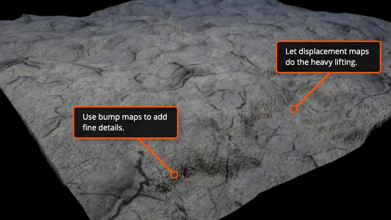

# Week2

## #5.4 재질 textures pt4

<aside>
✅ 챕터목표  <br/>


- aoMap, normalMap, alphaMap, roughnessMap, displacementMap등 텍스쳐 매핑의 개념을 간단히 이해한다.
</aside>

### Texture properties


위 이미지와 같이 메시에 텍스쳐를 매핑하기 위해서, `TextureLoader`로 각각의 텍스쳐 맵 image들을 불러온 후, Material에 매핑한다.
코드는 아래와 같다.

```tsx
  const textureLoader = new THREE.TextureLoader();
  ...
    const mat = new THREE.MeshStandardMaterial({
      // baseColor image에 해당한다. Diffuse Map이라고도 함
      map: map,

      // mesh에 대한 광원값 계산. 각 픽셀 별 좌표에 대한 법선 벡터를 이미지 내 rgb값으로 계산
      normalMap: mapNormal,

      // hiehgt map 속성, Scale은 말그대로 높이의 값이고 Bias
      displacementMap: mapHeight,
      displacementScale: 0.2,
      // displacementBias: 0.2,

      // 환경맵 속성. Ambient light랑 함께 작동한다.
      aoMap: mapAO,
      aoMapIntensity: 1,

      // texture roughness
      roughnessMap: mapRough,
      roughness: 0.2,

      // metal texture
      metalnessMap: mapMetal,
      metalness: 0.9,

      // opacity properties
      alphaMap: mapAlpha,
      transparent: true,
      side: THREE.DoubleSide, //glass 텍스쳐의 양면 렌더링

      // 텍스쳐로 만들 수 있는 light map. 별도의 이미지 필요
      lightMap: map,
      lightMapIntensity: 1,
      lightMapType: THREE.PCFSoftShadowMap,
      lightMapEncoding: THREE.sRGBEncoding,
      lightMapRepeat: new THREE.Vector2(1024, 1024),
    });
```

[Playground](https://cpetry.github.io/NormalMap-Online/)

##### ao map

- ambient occlusion map
- 먼저 `Ambient`는 광원으로부터 직접 받는 빛(직사광선)이외의 주변의 물체등에 반사되어서 받는 '주변광들을 단순화' 시켜서 빛의 방향과 면의 법선에 관계없이 일정한 량의 빛을 받는다고 가정한 개념입니다.
- `Occlusion`은 그런 주변광이 닿지않는 정도를 말한다.
- 정리하면 `Ambient Occlusion`은 직사광선 외의 주변 물체등에 의한 주변광의 명암을 표현한 이미지이다.
-

##### normal map

- 각 좌표의 법선 벡터 값을 연산하도록 도와주는 RGB 이미지로, 가상의 깊이를 만들어준다.
- 실제 메시에 입체감을 주는 것보다 효율적이다.

##### displacement map

- 메시 자체의 입체감을 만들기 위해 사용하는 이미지.
- 기본 Geometry에서 texutre 만으로 메시 입체감을 표현하고자 한다면, 표현하고자 하는 디테일의 정도에 따라 mesh가 subdivided 되어 있어야한다.

#### Difference between bump, normal and displacement map



- Bump map이란 텍스쳐맵도 있는데 이는 좌표의 Y축, 즉 수직 정보만을 갖고 있다.
- Normal map은 X,Y,Z 3축의 정보를 모두 갖고 있다.
- Displacement map은 지오메트리의 입체 정보 모두를 갖고 있어 지오메트리를 텍스쳐 오브젝트로 연산해 만들어준다.
