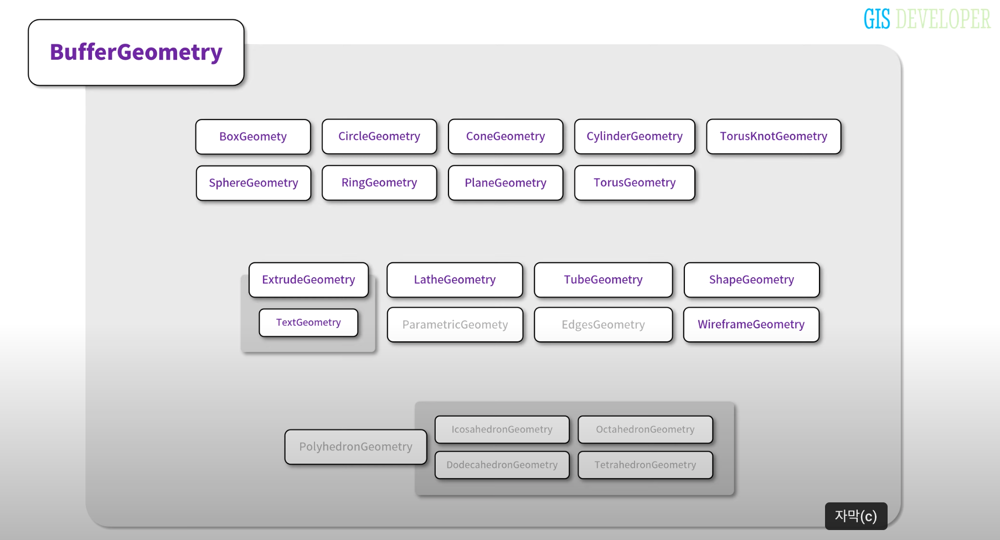
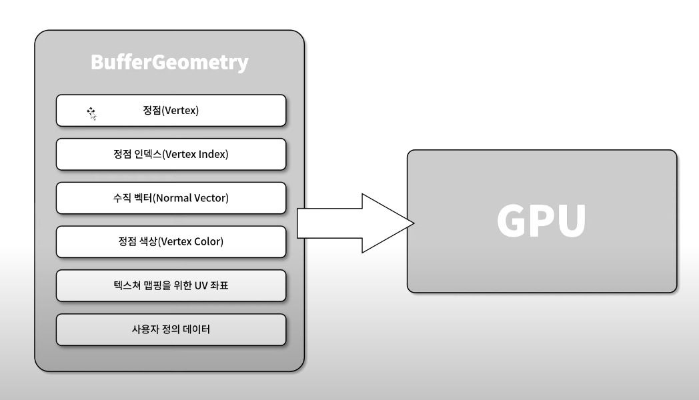
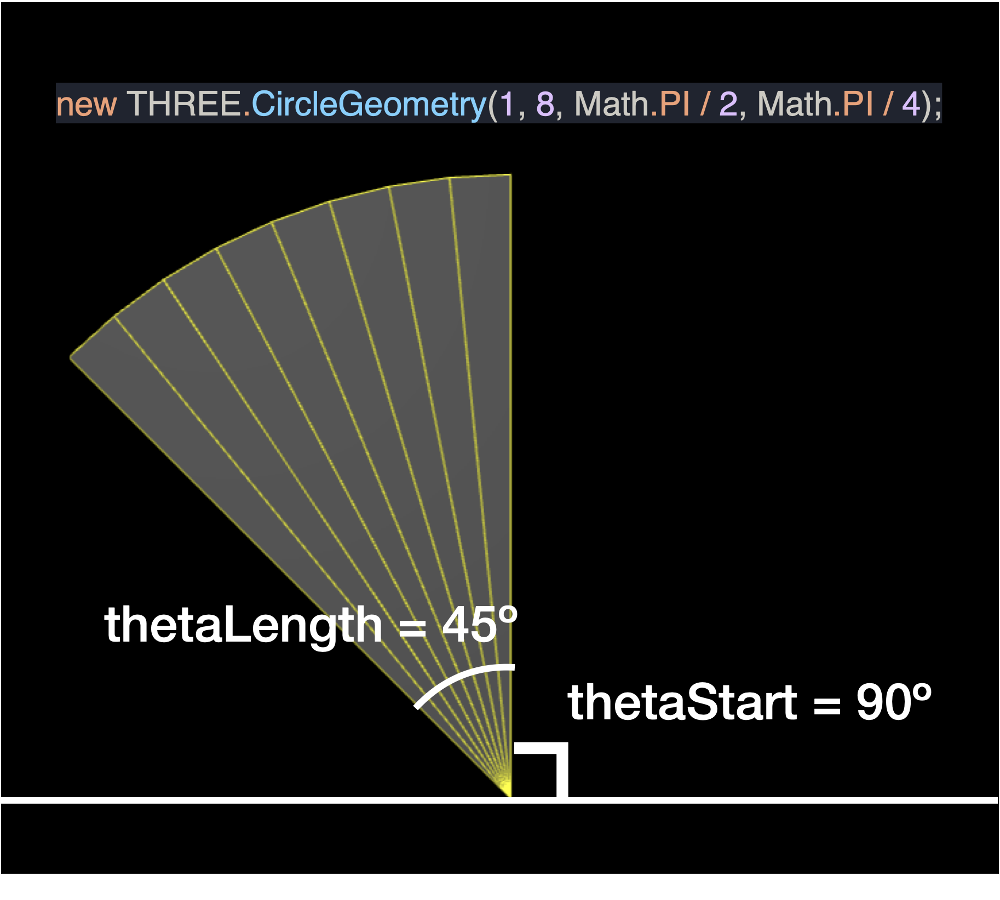

# 3강 Geometry



## BufferGeometry

Geometry는 기본적으로 BufferGeometry를 상속받는다.

Geometry의 형상을 정의하기 위한 데이터는 총 6가지이다.



### Geometry의 형상을 정의하기 위한 데이터

1. 정점: xyz 축에 대한 좌표
2. 정점 인덱스: 3차원 오브젝트의 면을 구성하는 정점에 대한 인덱스
3. 수직 벡터: 정점에 대한 수직 벡터
4. 정점 색상: 벡터 정점의 색상
5. 텍스쳐 맵핑을 위한 UV 좌표
6. 사용자 정의 데이터

3차원 시각화는 이 여섯 가지 데이터가 GPU에 전달되면서 처리된다.

<aside>
❓ UV 좌표란
</aside>


- UV 좌표는 텍스쳐 이미지를 3차원 오브젝트에 입히기 위한 변환 기준.
- 3D 모델의 표면을 2차원 좌표로 전개하면 UV 좌표가 된다
- 좌표값은 0 ~ 1 사이의 값만 가질 수 있다.

## three.js가 제공하는 Geometry

- `ParametricGeometry`: 수학적 함수식에 2개의 값을 입력하여 얻을 수 있는 좌표로 구성되는 Geometry
- `EdgesGeometry`: 지오메트리를 구성하는 인접면의 각도에 따라 Geometry를 재구성함
- `PolyhedrongGeometry`: 다면체를 구성하는 Geometry

그 외 Geometry는 실습을 통해 하나씩 알아보도록 한다.

### Geometry를 이해하기 위한 준비 코드 작성

#### 1. `geometry`를 와이어프레임 형태로 표현하기 위해 LineSegments 객체를 `geometry` 모델과 그룹핑한다

```jsx
const line = new THREE.LineSegments(new THREE.WireframeGeometry(geometry), lineMaterial);
const group = new THREE.Group();

group.add(cube);
group.add(line);
this._scene.add(group);
```

- `LineSegments`: 정점 쌍들을 연결하는 line 오브젝트
- `WireframeGeometry`: 모델의 모든 외곽선을 표시하기 위한 Geometry
- `Group`: 서로 다른 오브젝트를 하나의 오브젝트로 묶어서 다룰 수 있음

#### 2. 사용자가 마우스를 이용해 오브젝트를 직접 회전시킬 수 있도록 한다.

- three.js examples에서 제공하고 있는 OrbitControls.js 코드를 임포트하여 사용
- `OrbitsControls`는 Camera와 마우스 이벤트를 받는 DOM element(`_divContainer`) 를 받음

## three.js가 제공하는 Geometry 사용해보기

[three.js 공식문서](https://threejs.org/docs/index.html#api/en/geometries/BoxGeometry)에서 Geometry의 인자를 변경해가며 결과를 바로 확인할 수 있다.

### Geometry의 파라미터
Geometry의 사이즈를 조절하는 파라미터 외에도 다음과 같은 파라미터가 사용된다.

- `segments`: 분할수
    - ex) `CircleGeometry`(2차원 원반 형상)의 segments값에 따라 삼각형, 사각형, …, 원형(에 가까운 형상)이 된다.
    - ex) `ConeGeometry`(3차원 고깔 형상)의 radial segments에 따라 삼각뿔, 사각뿔, …, 원뿔(에 가까운 형상)이 된다.
- theta: radian 단위를 사용하며, 형상의 각도를 조절한다
    
    
    
    - thetaStart: 시작 각도. 기본값 0
    - thetaLength: 연장 각도. 기본값 2pi
- openEnded: 바닥 또는 천장이 있는 형상일 경우 false면 막혀있고 true이면 뚫려있다

### ShapeGeometry

생성 시 Shape 클래스 객체를 인자로 받음

Shape 객체를 Mesh로 표현한다.

#### Shape 클래스: 2차원 도형을 정의하는 클래스

- moveTo(x, y): 좌표 이동
- lineTo(x, y): 현재 좌표에서 (x, y) 좌표까지 선을 그음
- closePath(): 도형을 닫는다
- bezierCurveTo(): 베이저 곡선을 그린다

### TubeGeometry

생성 시 Curve 클래스 객체를 인자로 받음

Curve 곡선을 따라서 원통이 이어지는 Mesh

#### Curve 클래스: 곡선을 정의하는 클래스

- Curve 클래스를 상속받고 `getPoint(t)`를 override하여 곡선을 정의할 수 있다.
- 커브는 `getPoint(t)` 에서 방정식으로 정의한다
- `getPoints(divisions)`:  divisions는 커브를 구성하는 좌표의 개수. 값이 클수록 더 부드러운 곡선이 된다.

### LatheGeometry

y축으로 회전하여 얻어지는 3차원 Mesh

생성 시 회전시킬 도형을 인자로 받음

실습에서는 2차원 Vector array를 인자로 받고 이 것을 y축에 대해 회전시킨다.

```jsx
const points = [];
for (let i = 0; i < 10; ++i) {
  points.push(new THREE.Vector2(Math.sin(i * 0.2) * 3 + 3, (i - 5) * 0.8));
}
```

### ExtrudeGeometry

생성 시 Shape 클래스 객체와 세팅값이 들어있는 object를 인자로 받음

평면 Shape에 깊이 값을 부여해 주고 Mesh의 윗 면과 밑 면을 비스듬하게 처리해 주는 Geometry

_** extrude: 돌출하다, beveling: 비스듬하게 하기, 사각 만들기._

#### ExtrudeGeometry의 세팅값

- steps: 깊이를 따라 segments로 분리할 때 사용되는 point의 개수
- depth: 어느 깊이까지 Shape을 돌출시킬 지
- bevelEnabled: 베벨링 여부
- bevelThickness: 베벨링을 원래 Shape으로부터 얼마나 깊게 할 것인지
- bevelSize: 베벨이 Shape의 테두리로부터 얼만큼 확장될 수 있는 지
- bevelSegments: 베벨 layer 개수

### TextGeometry

`ExtrudeGeometry`를 상속받는다.

font 데이터가 필요하며, font를 로드할 때는 FontLoader 클래스를 사용한다.

- FontLoader.load(): font 데이터를 비동기적으로 로드하는 함수
- 로드된 font를 TextGeometry에 전달하면 해당 font로 3D 텍스트가 렌더링된다.