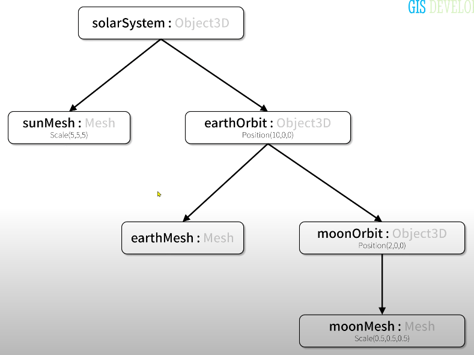
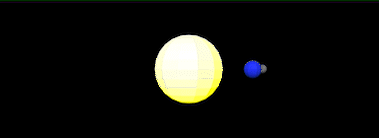
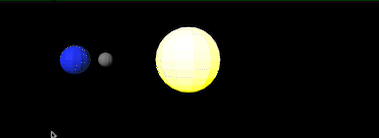

# 4강 Scene Graph를 이용한 공간구성

## 시작하기 전에

3차원 공간 상에 놓여지는 Object3D의 파생 클래스는 3가지가 있다.

- Mesh: 삼각형 면으로 구성된 객체
- Line: 선형 객체
- Points: 점

이 3D 오브젝트가 3차원 공간 상에 놓여지기 위해서는 다음 값을 필요로 한다.

- Position: 위치
- Rotation: 회전
- Scale: 크기

*이 값들은 4x4 크기의 행렬 정보로 변환된다.*

### 목표

- xyz 공간 상에 여러 3D 객체를 구성하는 코드를 작성해본다.
- 공간 구성에 Scene Graph를 이용한다.
- 태양과 지구, 달의 자전과 공전을 구현한다.

---

## Scene Graph로 3D 공간 구성하기

> scene graph를 코드로 작성하는 것 = 3차원 객체를 공간상에 구성한다는 것
> 



화살표는 부모 → 자식을 뜻한다

- 부모-자식 관계로 각 Object3D의 계층 구조를 설계하고 공간을 구성한다
- Mesh가 Object3D 안에 배치된다.

## PRACTICE: Scene graph를 코드로 구현하기

### 태양 만들기

1. `solarSystem` Object3D를 만들고 `scene`에 추가하기
    
    ```jsx
    const solarSystem = new THREE.Object3D();
    this._scene.add(solarSystem);
    ```
    
    - solarSystem이 Scene graph의 최상단에 있으므로 scene에 추가해준다.
2. 구 형태 지오메트리 생성
    
    ```jsx
    const sphereGeometry = new THREE.SphereGeometry(radius, widthSegments, heightSegments);
    ```
    
3. 태양의 material 정의
    
    ```jsx
    const sunMaterial = new THREE.MeshPhongMaterial({
      emissive: 0xffff00,
      flatShading: true,
    });
    ```
    
4. 지오메트리와 material로 태양 메쉬 생성, scale 조정, `solarSystem`에 추가
    
    ```jsx
    const sunMesh = new THREE.Mesh(sphereGeometry, sunMaterial);
    sunMesh.scale.set(3, 3, 3);
    solarSystem.add(sunMesh);
    ```
    

### 지구 만들기

1. `earthOrbit` Object3D를 만들고 `solarSystem`에 추가
    
    ```jsx
    const earthOrbit = new THREE.Object3D()
    earthOrbit.position.x = 10  // solarSystem으로부터 10만큼 오른쪽으로 이동
    solarSystem.add(earthOrbit)
    ```
    
    - Scene graph에서 earthOrbit은 solarSystem의 자식이므로 scene이 아니라 solarSystem에 추가
    - 태양으로부터 10만큼 떨어져 있도록 earthOrbit의 위치를 조정한다.
2. 동일한 방식으로 지구의 메쉬를 생성하고 earthOrbit에 추가
    
    ```jsx
    const earthMesh = new THREE.Mesh(sphereGeometry, earthMaterial);
    earthOrbit.add(earthMesh);
    ```
    

### 달 만들기

1. moonOrbit Object3D를 만들고 `earthOrbit`에 추가
    
    ```jsx
    const moonOrbit = new THREE.Object3D();
    moonOrbit.position.x = 2; // earthOrbit에서 2만큼 오른쪽으로 이동
    earthOrbit.add(moonOrbit);
    ```
    
    - Scene graph에서 moonOrbit은 earthOrbit의 자식이므로 earthOrbit에 추가
    - 지구로부터 2만큼 떨어져 있도록 moonOrbit의 위치를 조정한다.
2. 동일한 방식으로 달의 메쉬를 생성하고 moonOrbit에 추가
    
    ```jsx
    const moonMesh = new THREE.Mesh(sphereGeometry, moonMaterial);
    moonMesh.scale.set(0.5, 0.5, 0.5);
    moonOrbit.add(moonMesh);
    ```
    

### solarSystem을 y축에 대하여 회전시키기

render 메소드에서 호출하는 update 메소드에서 `solarSystem`의 rotation값을 변경한다

```jsx
render(time) {
  this._renderer.render(this._scene, this._camera); // renderer가 scene을 camera의 시점으로 렌더링함
  this.update(time); // 속성값을 변경하여 애니메이션 효과 구현
  requestAnimationFrame(this.render.bind(this)); // render 메소드를 적당한 시점에, 최대한 빠르게 반복 호출
}

update(time) {
  time *= 0.001; // ms -> s
  this._solarSystem.rotation.y = time / 2
}
```

- time은 계속 증가하는 값이므로 solarSystem이 계속 회전하게 된다

#### 결과



> 지구는 태양의 자식이고 달은 지구의 자식이므로 태양의 회전에 영향을 받는다.
> 
- 태양 뿐만 아니라 지구와 달도 태양을 중심으로 회전하고 있다
- 지구와 달은 공전만 할 뿐 아직 자전하고 있지는 않다

### 지구와 달 자전 시키기

update 메소드에 다음 코드를 추가한다

```jsx
this._earthOrbit.rotation.y = time * 2
this._moonOrbit.rotation.y = time * 5
```

#### 최종 결과



- 마찬가지로 지구를 회전시키면 지구의 자식인 달도 지구를 중심으로 회전한다
---
## 정리

- Scene graph로 3차원 객체 공간을 구성할 수 있다.
- Scene graph를 이용하면 3차원 객체를 원하는 공간에 구성하기 위해서 복잡한 수학적 변환 식을 사용하지 않아도 된다.