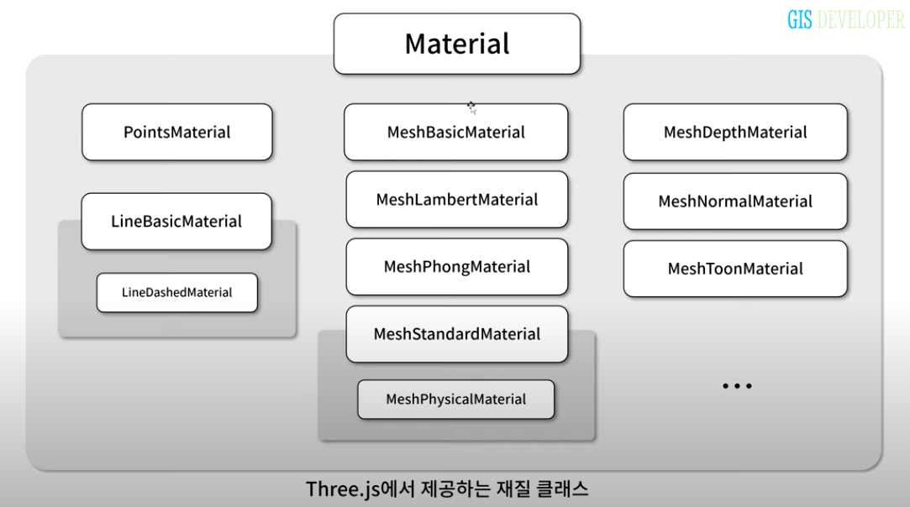
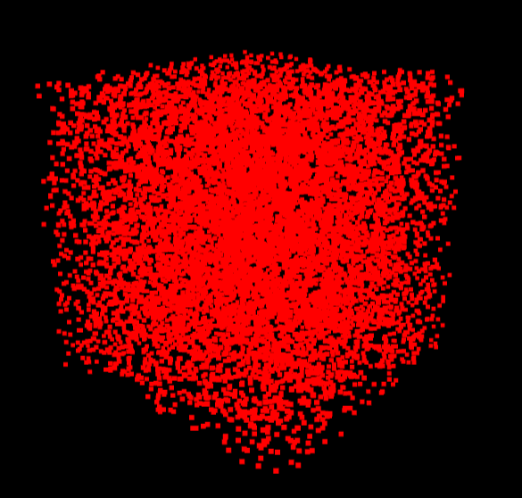
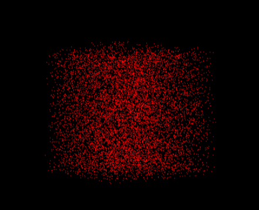
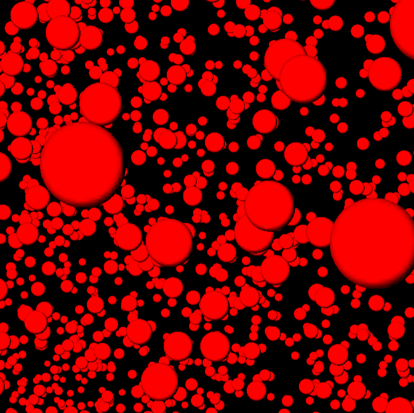
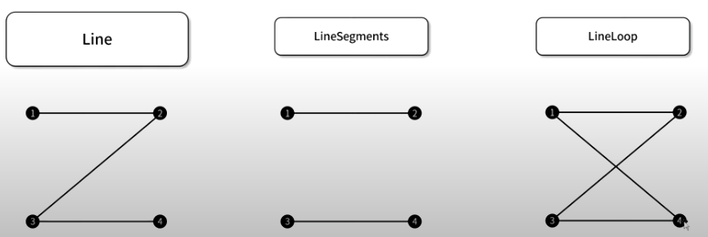
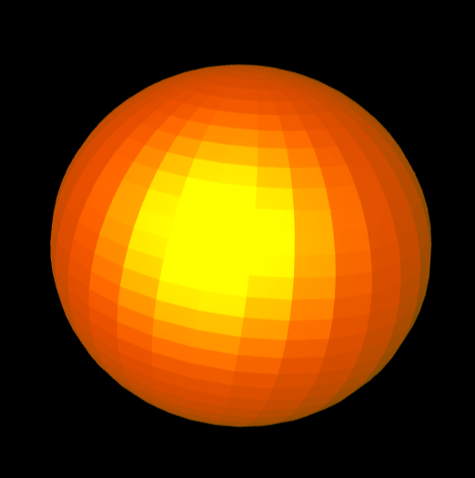
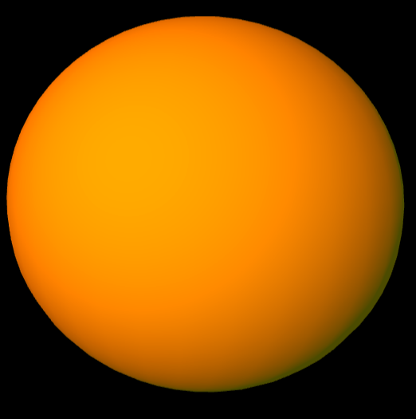

# 5강 재질 (part1 ~ 2)

지오메트리와 함께 Object3D 객체를 생성하기 위한 필수 요소

Object의 세 가지 파생 클래스 (Mesh, Line, Points) 각각을 위한 클래스로 분류되어 제공된다



## Material

모든 material 파생 클래스는 부모 클래스인 Material의 속성을 사용할 수 있다

```jsx
const material = new THREE.MeshBasicMaterial({
  // Material의 속성값 (기본값으로 설정)
  visible: true,
  transparent: true,
  opacity: 1,
  depthTest: true,
  depthWrite: true,
  side: THREE.FrontSide,

  // MeshBasicMaterial의 속성값
  color: 0xffffff,
  wireframe: false,
});
```

- `visible`: 렌더링 시 mesh가 보일지 안보일 지
- `transparent`: 불투명도(opacity)를 사용할 지 여부
- `opacity`: 재질의 불투명도를 지정 (0~1 사이의 값) 0은 완전 투명, 1은 완전 불투명
- `depthTest`: 렌더링 되고 있는 Mesh의 픽셀 위치의 z값을 depth buffer 값을 이용해 검사할 지에 대한 여부
- `depthWrite`: 렌더링되고 있는  Mesh의 픽셀에 대한 z값을 depth buffer에 기록할지에 대한 여부
- `side`: mesh를 구성하는 삼각형 면에 대해 앞 면만 렌더링할 것인지, 뒷 면만 렌더링 할 것인지, 모두 렌더링 할 것인지 지정 (광원의 영향을 받지 않는 재질(MeshBasicMaterial 등)에서는 차이를 잘 파악할 수 없음)

### Mesh의 side

삼각형 면이 앞면인지는 삼각형을 구성하는 좌표가 반시계 방향으로 구성되었는 지로 결정한다

### Depth Buffer

깊이 버퍼 또는 z 버퍼라고 불린다

3차원 객체를 카메라를 통해 좌표로 변환시켜 화면상에 렌더링 될 때, 해당 3차원 객체를 구성하는 각 픽셀에 대한 z 좌표값을 0~1로 정규화시킨다. 이 정규화된 z값이 저장된 버퍼가 z 버퍼.

이 값이 작을수록 카메라에서 가까운 3차원 객체의 픽셀 

주로 더 멀리 있는 3차원 객체가 가까운 객체를 덮지 않도록 하기 위해 사용

---

## Points 타입의 Object3D Material

### PointsMaterial

```jsx
const material = new THREE.PointsMaterial({
  color: 0xff0000,
  size: 1,
  sizeAttenuation: false
})
```

`sizeAttenuation`: 포인트가 카메라의 거리에 따라 크기가 감쇄되도록 함. (기본값은 true)



sizeAttenuation === true
카메라와 가까운 포인트와 먼 포인트의 크기가 다르다



sizeAttenuation === false
거리에 상관없이 항상 같은 크기의 포인트로 렌더링된다

### point 모양 변경하기

작은 원 이미지를 이용해서 모양을 변경해보자

```jsx
const sprite = new THREE.TextureLoader().load("/assets/disc.png")
const material = new THREE.PointsMaterial({
  map: sprite,
  alphaTest: 0.5,
  color: 0xff0000,
  size: 0.1,
  sizeAttenuation: true
})
```

- TextureLoader를 이용하면 이미지를 로드해서 texture 객체로 만들 수 있다
- alphaTest: 이미지의 픽셀 값 중 알파값이 이 값보다 클 때만 픽셀이 렌더링된다.

#### 결과



---

## Line 타입의 Object3D Material

### 라인 렌더링 방식

Line 타입의 Object3D는 vertices의 구성 좌표가 순서대로 연결 되어 라인으로 렌더링된다.

vertices가 다음과 같을 때 각 Line 타입별로 아래와 같이 렌더링된다.

```jsx
const vertices = [
  -1, 1, 0, 
  1, 1, 0, 
  -1, -1, 0, 
  1, -1, 0
];
```



- **Line**: vertices의 순서대로 연결된다
- **LineSegments**: vertices를 2개씩 짝지어서 하나의 선으로 렌더링한다
- **LineLoop**: Line과 동일한 방식으로 렌더링 되다가 마지막 좌표와 첫 번째 좌표를 연결시킨다.

### LineBasicMaterial

color 속성으로 선의 색상값만 지정할 수 있다. (굵기는 변경할 수 없음)

```jsx
const material = new THREE.LineBasicMaterial({
  color: 0xffff00
})
```

### LineDashedMaterial

선의 길이를 참조해서 재질이 적용되므로 선의 길이를 계산해주어야 한다. `line.computeLineDistances()`

```jsx
const material = new THREE.LineDashedMaterial({
  color: 0xffff00,
  dashSize: 0.2,
  gapSize: 0.1,
  scale:1
});

const line = new THREE.LineLoop(geometry, material);
line.computeLineDistances()
```
---

## Mesh 타입의 Object3D Material

### MeshBasicMaterial

- `color`: 색상
- `wireframe`: mesh를 선 형태로 렌더링할지에 대한 여부

### MeshLambertMaterial

mesh를 구성하는 정점에서 광원의 영향을 계산하는 재질

```jsx
const material = new THREE.MeshPhongtMaterial({
  color: 0xff0000,
  emissive: 0x555500,
  wireframe: false,
});
```

- `emissive`: 다른 광원에 영향을 받지 않는, material 자체에서 방출하는 색상 값
    
    ** 검정색으로 지정할 경우 아무런 색도 방출하지 않음
    

### MeshPhongMaterial

mesh가 렌더링되는 픽셀 단위로 광원의 영향을 계산하는 material

```jsx
const material = new THREE.MeshPhongMaterial({
  color: 0xff0000,
  emissive: 0x555500,
  specular: 0xffff00,
  shininess: 10,
  flatShading: true,
});
```

- `specular`: 광원에 의한 반사 되는 색상. (기본값은 연한 회색)
- `shininess`: specular 색으로 반사되는 정도
- `flatShading`: mesh를 평평하게 렌더링 할지에 대한 여부



shiness === 10 && flatShading: true



shiness === 1 && flatShading: false

## 물리기반 렌더링(PBR)을 위한 Material

- MeshStandardMaterial와 MeshPhysicalMaterial, 2가지가 존재
- 3차원 그래픽에서 가장 많이 사용하는 재질이다.
- 속도면에서는 다른 재질에 상대적으로 느리지만 훨씬 고품질의 렌더링 결과를 얻을 수 있다.

### MeshStandardMaterial

```jsx
const material = new THREE.MeshStandardMaterial({
    color: 0xff0000,
    emissive: 0x555500,
    roughness: 0.25,
    matalness: 1,
    wireframe: false,
    flatShading: false,
  });
```

- `roughness`: 거칠기(0~1). 0일 경우 표면이 마치 거울과 같은 상태. 1일 경우 표면에 광원이 반사되지 않음
- `metalness`: 금속성(0~1). 0일 경우 돌과 같은 상태. 1일 경우 완전한 금속성

### MeshPhysicalMaterial

MeshStandardMaterial을 상속 받고 있는 보다 발전된 물리 기반 렌더링 재질

표면에 코팅 효과를 줄 수 있고, 단순 투명도 처리가 아닌 실제 유리같은 효과를 표현할 수 있다

- `clearcoat`: 0~1 사이 값. 0이면 mesh의 표면에 코팅이 전혀 안되어 있는 재질, 1이면 코팅에 대한 효과를 최대로 표현
- `clearcoatRoughness`: 0~1 사이 값. 코팅의 거칠기

clearcoat값이 커질 수록 코팅 효과가 적용되어 광원의 반사 효과가 나타난다.

---

## 마무리

- 재질은 자신의 속성값 변화와 외부 광원에 영향을 매우 크게 받는다.
- 원하는 재질 효과를 얻기 위해서 다양한 경험이 필요하다