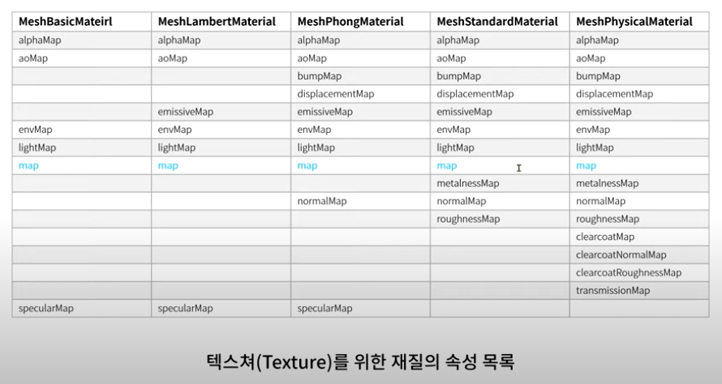
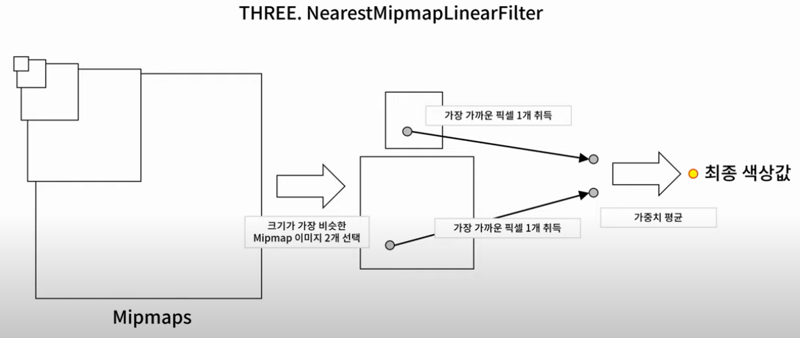

# 5강 재질 part3 - 텍스쳐



## map 속성

- 텍스쳐 객체를 지정하면 지오메트리의 표면에 지정된 텍스쳐의 이미지가 옷처럼 입혀짐
- 메쉬의 모든 meterial에 적용할 수 있다

### 텍스쳐 객체

- 이미지나 동영상 등을 통해 생성된다
- TextureLoader를 통해 변환할 수 있다

## UV 좌표

텍스쳐 맵핑은 지오메트리에 UV 좌표로 맵핑되어 있다.

- 0과 1 사이의 값을 가진다.
- U: 수평 방향에 대한 축, V: 수직 방향에 대한 축
- three.js의 uv 좌표 (0,0)은 좌측 하단이고, (1,1)은 우측 상단이다.


## PRACTICE: MeshStandardMaterial에 텍스쳐 적용하기

가장 많이 사용되는 MeshStandardMaterial에 적용해보자

1. 이미지로 텍스쳐 객체 생성하기
    
    ```jsx
    const textureLoader = new THREE.TextureLoader();
    const map = textureLoader.load(
      '/assets/uv_grid_opengl.jpg',
      texture => {}
    )
    ```
    
    - 이미지가 네트워크에서 성공적으로 다운로드되고 텍스쳐 생성이 완료되면 콜백 함수가 실행된다.

2. material의 map 속성에 이 객체를 지정해준다.
    
    ```jsx
    const material = new THREE.MeshStandardMaterial({
      map
    });
    ```
    
3. 텍스쳐의 속성을 지정한다.
    
    텍스쳐의 속성은 텍스쳐 객체가 생성된 이후에 설정 되어야 함
    
    textureLoader.load의 콜백 함수에서 구현해준다.
    
    ```jsx
    const map = textureLoader.load(
      '/assets/uv_grid_opengl.jpg',
      texture => {
        // texture의 반복수
        texture.repeat.x = 1
        texture.repeat.y = 1
        // texture를 어떻게 반복할 것인지 지정
        texture.wrapS = THREE.RepeatWrapping
        texture.wrapT = THREE.RepeatWrapping
      }
    )
    ```
    

## texture의 wrapS, wrapT 속성

texture.repeat 속성과 함께 사용되며, texture를 어떻게 반복할 것인지 지정

- `RepeatWrapping`: 이후 반복에 같은 이미지로 채움
- `ClampToEdgeWrapping`: 이후 반복에 이미지의 끝단 픽셀로만 나머지 영역을 채움
- `MirroredRepeatWrapping`: 짝수번째 반복에서 이미지가 뒤집힌 모양으로 맵핑

## texture의 magFilter, minFilter 속성

텍스쳐 이미지의 원래 크기보다 확대 또는 축소 되어 렌더링 될 때 사용하는 필터

### magFilter

- `LinearFilter`: 가장 가까운 4개의 픽셀 색상을 얻어와 선형 보간한 값을 사용
- `NearestFilter`: 가장 가까운 하나의 픽셀 색상을 가져와서 사용 → 이미지를 확대할수록 계단 현상이 발생 (기본값)

### minFilter

*** mipMap: 원래의 이미지 크기를 절반으로 줄여서 미리 만들어 놓은 이미지 셋*

- `NearestFilter`: mipMap을 사용하지 않고 가장 가까운 픽셀 하나를 가져와 사용
- `LinearFilter`: mipMap을 사용하지 않고 가장 가까운 4개의 픽셀 색상을 얻어와 선형 보간한 값을 사용
- `NearestMipmapNearestFilter`: 렌더링할 크기와 가장 가까운 mipMap 이미지 1개를 선택한 후 가장 가까운 픽셀 1개를 사용
- `LinearMipmapNearestFilter`: 렌더링할 크기와 가장 가까운 mipMap 이미지 1개를 선택한 후 가장 가까운 4개의 픽셀 색상을 얻어와 선형 보간한 값을 사용
- `LinearMipmapLinearFilter`: 렌더링할 크기와 가장 가까운 MipMap 이미지 2개를 선택한 후 가장 가까운 픽셀 4개를 얻는다. 이를 선형 보간하여 2개의 색상값을 얻고 이를 다시 가중치 평균한 값을 사용
- `NearestMipmapLinearFilter`: 렌더링할 크기와 가장 가까운 mipMap 이미지 2개를 선택한 후 가장 가까운 픽셀을 1개씩 얻는다. 이 2개의 픽셀의 가중치 평균값을 사용한다.
    
    
    

### minFilter로 mipMap을 사용하는 것이 항상 옳을까?

**장점**

- 품질이 좋다

**단점**

- mipMap 생성에 사용하는 메모리가 크다
- 렌더링 시 하나의 픽셀값을 결정하기 위한 연산량이 모두 다르다

> 텍스쳐 맵핑의 크기 등을 고려하여 적절한 minFilter 값을 지정해야 한다
> 

