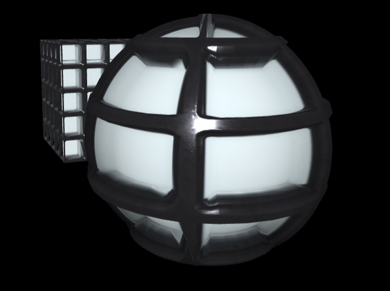

# 5강 재질 part4 - 텍스쳐2

## 준비하기
연습하기 전, 사용할 텍스쳐 이미지를 준비해야 한다.

[여기에서](https://3dtextures.me/2020/07/15/glass-window-002/) 텍스쳐 이미지를 다운받는다.


해당 이미지의 해상도와 map 속성에 지정할 수 있는 이미지가 어떤 것이 포함되어있는지 알 수 있다.

### TextureLoader로 이미지 파일에서 텍스쳐 가져오기
TextureLoader를 이용

```jsx
const textureLoader = new THREE.TextureLoader();

const map = textureLoader.load("/assets/images/glass/Glass_Window_002_basecolor.jpg");
const mapAO = textureLoader.load("/assets/images/glass/Glass_Window_002_ambientOcclusion.jpg");
const mapHeight = textureLoader.load("/assets/images/glass/Glass_Window_002_height.png");
const mapNormal = textureLoader.load("/assets/images/glass/Glass_Window_002_normal.jpg");
const mapRoughness = textureLoader.load("/assets/images/glass/Glass_Window_002_roughness.jpg");
const mapMetalic = textureLoader.load("/assets/images/glass/Glass_Window_002_metallic.jpg");
const mapAlpha = textureLoader.load("/assets/images/glass/Glass_Window_002_opacity.jpg");

```

---

## map 속성만 적용했을 때

```jsx
const material = new THREE.MeshStandardMaterial({
  map: map,
});
```


- 입체감이 뚜렷하지 않다.

## normalMap

- 법선 벡터를 이미지화한 것
- 법선 벡터는 메쉬의 표면에 대한 수직 벡터로, **광원의 영향을 계산**하는데 사용한다.

```jsx
const material = new THREE.MeshStandardMaterial({
      map: map,
      normalMap: mapNormal
    });
```


- map만 적용했을 때보다 입체감이 보인다.


### normalMap이 입체감을 부여하는 방식
normalMap만 적용하고 법선벡터를 시각화하면 다음과 같이 보인다.


본래 지정되지 않은 특정 지점에 대한 법선 벡터는 구성 좌표의 법선 벡터들을 이용해 보간 계산된다.

하지만 normalMap을 사용하면 박스 표면의 법선 벡터를 normalMap 이미지의 RGB 값을 이용해 계산하게 된다. 따라서,

- 메쉬 표면의 각 픽셀에 대해 법선 벡터를 지정할 수 있다

- 각 픽셀 단위로 광원 효과가 달라져 입체감을 표현할 수 있게 된다.

> normalMap은 지오메트리 좌표를 변형하지는 않는다. 일종의 착시 효과를 이용해 입체감을 부여한다.

> 따라서 지오메트리의 매우 적은 좌표 구성만으로도 입체감을 효과적으로 표현할 수 있다.


## **displacementMap**
- normalMap과 달리 지오메트리 좌표를 변형시켜 입체감을 표현한다.
- 맵 이미지의 픽셀값이 밝을 수록 좌표의 변위가 커지게 된다.
- 지오메트리 좌표를 변형시키기 때문에 **메쉬 표면에 대한 구성 좌표를 제공**하여야 한다.

_아래 결과물은 box segment값은 256, sphere segment값은 512로 설정하였다._

```jsx
const material = new THREE.MeshStandardMaterial({
  normalMap: mapNormal,

  displacementMap: mapHeight,
  displacementScale: 0.2,
  displacementBias: -0.15
});
```
- `displacementScale`, `displacementBias`:  변위를 조정할 수 있는 속성


### displacementMap를 효과적으로 사용하려면
지오메트리 표면을 여러 개의 세그먼트로 분할해주어야 한다. 많은 세그먼트로 분할될 수록 맵 효과가 잘 적용된다.

> 하지만 좌표를 더 많이 추가하는 것은 렌더링 속도 면에서 비효율적이므로 적절한 노말 맵과 displacementMap 효과를 위한 적절한 세그먼트 분할이 필요

## aoMap
- 텍스쳐 이미지에 미리 음영 효과를 그려 넣은 것

_normalMap, aoMap만 적용했을 때 결과_


_map, normalMap, displacementMap, aoMap 적용_
```jsx
const material = new THREE.MeshStandardMaterial({
  map,
  normalMap: mapNormal,

  displacementMap: mapHeight,
  displacementScale: 0.2,
  displacementBias: -0.15,

  aoMap: mapAO,
  aoMapIntensity: 1  // 그림자 강도 지정
});
```


### aoMap을 사용할 시 유의할 점

aoMap 효과를 내려면 두 가지 작업이 필요하다.

1. scene에 `AmbientLight` 추가: 모든 mesh의 전체 면에 대해서 균일하게 비추는 광원
2. 지오메트리 속성에 uv2 데이터 지정
    ```jsx
    box.geometry.attributes.uv2 = box.geometry.attributes.uv
    sphere.geometry.attributes.uv2 = sphere.geometry.attributes.uv
    ```
    

> aoMap을 이용하면 미리 만들어진 세밀한 그림자와 같은 느낌의 효과를 지정할 수 있다.

## roughnessMap
- 거칠기에 대한 재질 적용
- 맵 이미지의 픽셀 값이 밝을 수록 거칠기가 강해짐
- `roughness` 속성으로 거칠기 조정
    - 낮을수록 반짝이는 플라스틱 느낌이 난다    

_roughness: 0.5_


## metalnessMap
- 금속 재질에 대한 느낌을 부여하는 맵
- `metalness` 속성으로 조정 (기본값: 0)




## alphaMap
- 투명도에 대한 맵 속성
- 이미지의 픽셀값이 밝을수록 불투명하게 되는데 픽셀값이 완전한 검정색일때 완전히 투명
- `transparent: true` 속성을 줘서 투명도를 활성화해주어야 함


** 메쉬의 뒷면도 렌더링해야되기 때문에 `side: THREE.DoubleSide` 추가


## lightMap
- 지정된 이미지의 색상으로 발광하는 느낌을 표현
- `lightMapIntensity` 속성으로 강도 조절