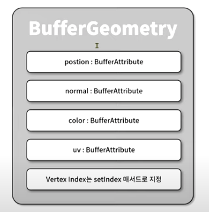
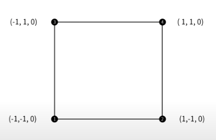
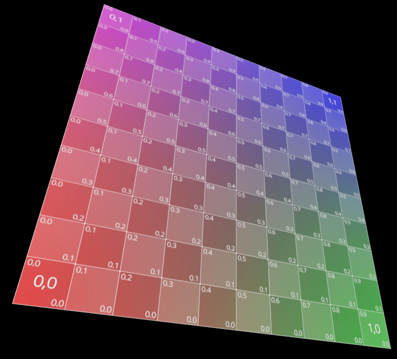

# 6강 사용자 정의 지오메트리

three.js가 제공하는 지오메트리 외에도 직접 정의하는 지오메트리를 만들어보자



geometry는 three.js에서 BufferGeometry 클래스를 통해 정의한다.

## BufferGeometry에 정의할 수 있는 속성

- position: geometry를 구성하는 3차원 좌표에 대한 정점(Vertex)
- normal: 각 정점에 대한 수직 벡터
- color: 각 정점에 대한 색상
- uv: 각 정점에 대한 텍스쳐 맵핑 좌표
- Vertex index: position 속성으로 지정된 정점에 대한 인덱스 배열
    - mesh를 구성하는 면의 최소 단위는 삼각형이고 이 삼각형은 3개의 정점으로 구성된다.
    - 이 삼각형을 구성하는 3개의 정점에 대한 position 속성에서의 정점 인덱스 번호가 Vertex index

## 간단한 사용자 지오메트리를 구현해보자


### 1. 정점 데이터 정의

```jsx
const rawPositions = [
  -1, -1, 0, 
  1, -1, 0, 
  -1, 1, 0, 
  1, 1, 0
];
const positions = new Float32Array(rawPositions);
```

### 2. 지오메트리의 position 속성 지정

```jsx
const geometry = new THREE.BufferGeometry();
geometry.setAttribute(
	"poisition", 
	new THREE.BufferAttribute(positions, 3)
); // 하나의 정점이 (x, y, z) 3개의 항목으로 구성됨을 의미
```

### 3. Vertex index 지정

**Vertex index는 삼각형 면을 정의한다.**
```jsx
geometry.setIndex([
  0, 1, 2,
  2, 1, 3
])
```
- 삼각형을 구성하는 정점의 배치 순서는 반시계 방향이다.
- 반시계 방향인 면이 앞면이다.


### 4. 모든 정점에 대해 법선 벡터 지정

법선 벡터는 광원이 메쉬의 표면에 비추는 입사각과 반사각을 계산하여 **재질과 함께 표면의 색상을 결정**한다.

#### 모든 정점에 대해 법선 벡터를 자동으로 지정하는 방법
```jsx
geometry.computeVertexNormals()
```
#### 법선 벡터를 직접 지정하는 방법
```jsx
const rawNormals = [
  0,0,1,
  0,0,1,
  0,0,1,
  0,0,1,
];
const normals = new Float32Array(rawNormals);
geometry.setAttribute("normal", new THREE.BufferAttribute(normals, 3));
```

### 5. 각 정점의 색상 값 지정

```jsx
const rawColors = [
      1,0,0,
      0,1,0,
      0,0,1,
      1,1,0,
    ];
const colors = new Float32Array(rawColors);
geometry.setAttribute("color", new THREE.BufferAttribute(colors, 3));
```

** 정점 색을 적용하려면 Material을 `vertexColors: true`로 지정해야한다.

```jsx
const material = new THREE.MeshPhongMaterial({ color: 0xffffff, vertexColors: true });
```

### 6. uv 속성으로 텍스쳐 맵핑

```jsx
// uv 좌표를 담고 있는 배열
const rawUvs = [
  0, 0,
  1, 0,
  0, 1,
  1, 1,
];
const uvs = new Float32Array(rawUvs);
geometry.setAttribute("uv", new THREE.BufferAttribute(uvs, 2));
```

```jsx
// 텍스0쳐 맵핑
const textureLoader = new THREE.TextureLoader();
const map = textureLoader.load("/assets/uv_grid_opengl.jpg");

const material = new THREE.MeshPhongMaterial({ color: 0xffffff, map });
```




```jsx
const rawPositions = [
  -1, -1, 0,
  1, -1, 0,
  -1, 1, 0,
  1, 1, 0
];
```

```jsx
const rawUvs = [
  0, 0,
  1, 0,
  0, 1,
  1, 1,
];
```
지오메트리 정점 좌표와 uv 좌표는 다음 표와 같이 맵핑된다.

| 지오메트리 정점 좌표 | uv 좌표 |
| --- | --- |
| (-1, -1, 0) | (0, 0) |
| (1, -1, 0) | (1,0) |
| (-1, 1, 0) | (0, 1) |
| (1, 1, 0) | (1, 1) |