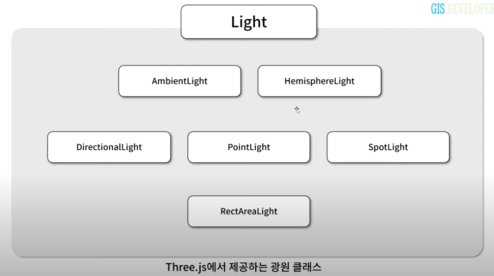
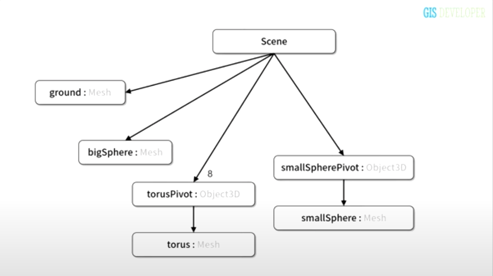

# 7강 광원


- `AmbientLight`, `HemisphereLight`: 환경광, 주변광
- `DirectionalLight`, `PointLight`, `SpotLight`, `RectAreaLight`: 단순한 주변광이 아닌 빛의 방향성을 가지는 광원
- 생성자에서 광원의 색상과 세기를 받음

## 준비하기

광원을 이해하기 위한 연습에 사용할 Scene을 다음 씬그래프로 구성한다.



## AmbientLight
scene에 존재하는 모든 물체에 대해서 단일 색상으로 렌더링되도록 한다.
- Usage: 대부분의 경우 세기값을 매우 약하게 지정해서 장면에 추가하여 광원의 영향을 받지 못하는 물체도 살짝 보여지도록 하는데 사용된다.

## HemiphereLight
AmibientLight와는 다르게 빛에 대한 색상값이 하나가 아니라 두 개이다.
- 하나는 위에서 비치는 빛의 색상 이고 다른 하나는 아래에서 비치는 빛의 색상

## DirectionalLight
태양처럼 빛과 물체간의 거리에 상관없이 동일한 빛의 효과를 준다.
- 따라서, 빛의 position와 target 속성의 position으로 결정되는 방향만 의미가 있다.
  - target은 광원이 비추는 대상

```jsx
const light = new THREE.DirectionalLight(0xffffff, 1);
light.position.set(0, 5, 0);
light.target.position.set(0, 0, 0);

this._scene.add(light.target);
```

## PointLight
빛이 광원 위치에서 사방으로 퍼져 나간다.
- `distance` 속성: 지정된 거리까지만 광원의 영향을 받도록 한다.
    - 기본값 0, 무한한 거리까지 영향을 받음

## SpotLight

빛이 광원의 위치에서 깔대기 모양으로 퍼져 나간다.

- angle 속성은 광원이 만드는 깔대기의 각도
- penumbra 속성은 빛의 감쇄율
    - 1에 가까울수록 빛이 중심에서 점점 감쇄

## RectAreaLight
형광등이나 창문에서 들어오는 광원이다.

- 광원의 가로와 세로 길이를 지정해야 함
- 광원의 형상이 물체의 표면에 비치게 된다.
- 광원의 방향을 대상의 위치로 지정 하는 것이 아닌, 각도로 지정한다는 차이점이 있다.

---

## 마무리
실제로는 고도화된 렌더링 결과를 위해 여러 종류의 광원을 2개 이상 설치하여 사용한다.

보다 사실적인 렌더링 결과를 위해서는 재질 뿐만 아니라 다양한 광원을 직접 테스트해 보는 시간이 필요할 것이다.