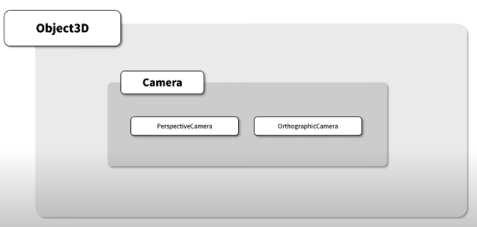
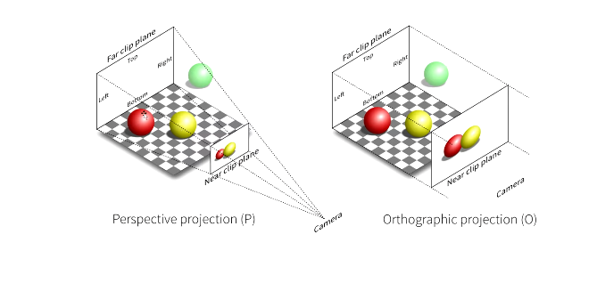
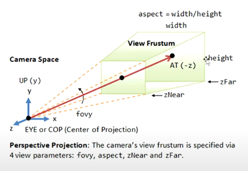
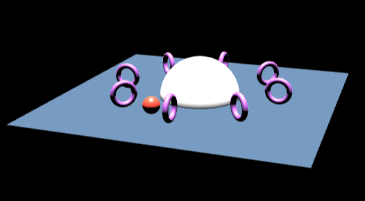
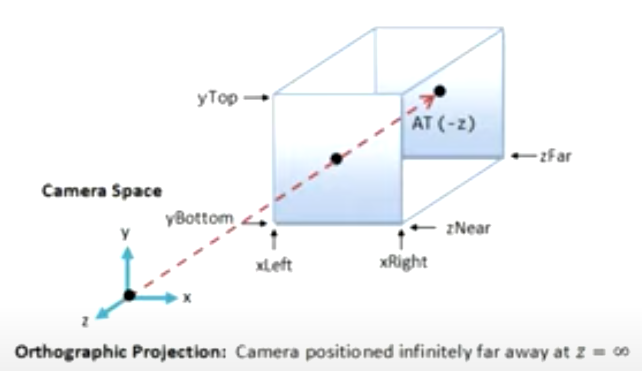
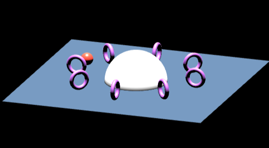
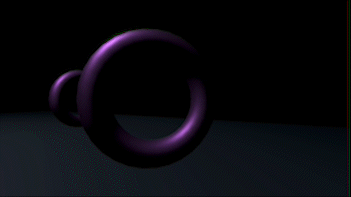
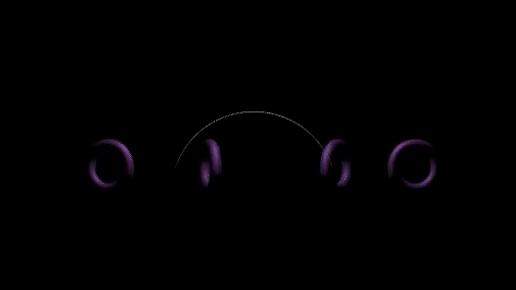

# 8강 카메라



카메라는 Camera 클래스를 상속받는다. 두 가지 종류가 있다.


- PerspectiveCamera: 원근감(거리감)을 표현한다.
    - 가까이 있는 물체가 멀리 있는 물체보다 상대적으로 크게 보이도록 렌더링
- OrthographicCamera: 원근감(거리감) 없이 표현한다.
    - 물체의 원래 크기대로 렌더링된다.




이 두가지 카메라의 차이점을 알아보자

## PerspectiveCamera

카메라를 정의하기 위해서 **4개**의 인자값이 필요



**절두체: 4개의 값을 통해 구성된 (아래 그림의 연두색) 육면체

이 절두체 안에 존재하는 물체가 카메라를 통해 보여지고 화면에 렌더링된다.

- fovy: 절두체 높이 방향의 각도 (단위: degree)
- aspect: 절두체 가로 길이를 세로 길이로 나눈 비율
- zNear, zFar: 카메라로부터의 거리
    - 거리 사이에 존재하는 물체의 일부만 렌더링되고 이 영역을 벗어나면 렌더링되지 않는다.

```jsx
const camera = new THREE.PerspectiveCamera(75, width / height, 0.1, 100);
camera.position.set(7, 7, 20); //카메라의 위치 지정
camera.lookAt(0, 0, 0); // 카메라가 바라보는 위치 지정
```

- fovy값은 75도
- aspect는 3차원 장면이 렌더링되는 DOM 요소의 가로 세로 비율
    
    ⇒ DOM 요소의 크기가 변경될 경우에 aspect값도 그 비율에 맞게 다시 지정해주어야 한다.
    
    ```jsx
    resize() {
      const width = this._divContainer.clientWidth;
      const height = this._divContainer.clientHeight;
    
      this._camera.aspect = width / height;
      this._camera.updateProjectionMatrix();
    
      this._renderer.setSize(width, height);
    }
    ```
    
- zNear와 zFar 거리 사이의 영역에 장면의 물체가 모두 들어오게 지정해주어야 한다.



## OrthographicCamera

(아래 그림에서 파란색) 정육면체인 절두체를 구성하기 위해 **6개**의 값이 필요



- xLeft, xRight: 위 그림에서 검정색 점을 원점으로 했을 때 수평축에 대한 좌표값
- yTop, yBottom: 검정색 점을 원점으로 했을 때 수직축에 대한 좌표값
- zNear, zFar: PerspectiveCamera의 값과 동일한 값

```jsx
const aspect = window.innerWidth / window.innerHeight;
const camera = new THREE.OrthographicCamera(
  -10 * aspect, 10 * aspect,  // xLeft, xRight
  10, -10,  // yTop, yBottom
  0.1, 100  // zNear, zFar
);
camera.zoom = 10; // 크기 조정
```

- xLeft와 xRight에 aspect를 곱하는 이유: DOM 요소 크기에 대한 종횡비를 적용시켜 자연스러운 결과를 얻기 위함

  ⇒ PerspectiveCamera와 마찬가지로 DOM 요소의 크기가 변경될 경우에 xLeft, xRight를 다시 지정해주어야 한다.

```jsx
resize() {
  const width = this._divContainer.clientWidth;
  const height = this._divContainer.clientHeight;
  const aspect = width / height;
  if(this._camera instanceof THREE.PerspectiveCamera) {
    this._camera.aspect = aspect;
  } else {
		// OrthographicCamera
    this._camera.left = -10 * aspect;
    this._camera.right = 10 * aspect;
  }

  this._camera.updateProjectionMatrix();

  this._renderer.setSize(width, height);
}
```



## 카메라가 특정 객체를 따라가도록 만들기

update 함수(렌더링 시간동안 계속 호출되는 함수)에서 다음 코드를 추가하면 카메라의 위치가 smallSphere 객체의 위치로 업데이트 된다.

```jsx
const smallSphere = smallShperePivot.children[0];
smallSphere.getWorldPosition(this._camera.position);
```

### PerspectiveCamera와 OrthographicCamera의 차이점 비교

카메라가 빨간색 구의 뒤쪽을 따라가도록 설정하면 둘의 차이점을 확실히 알 수 있다.


