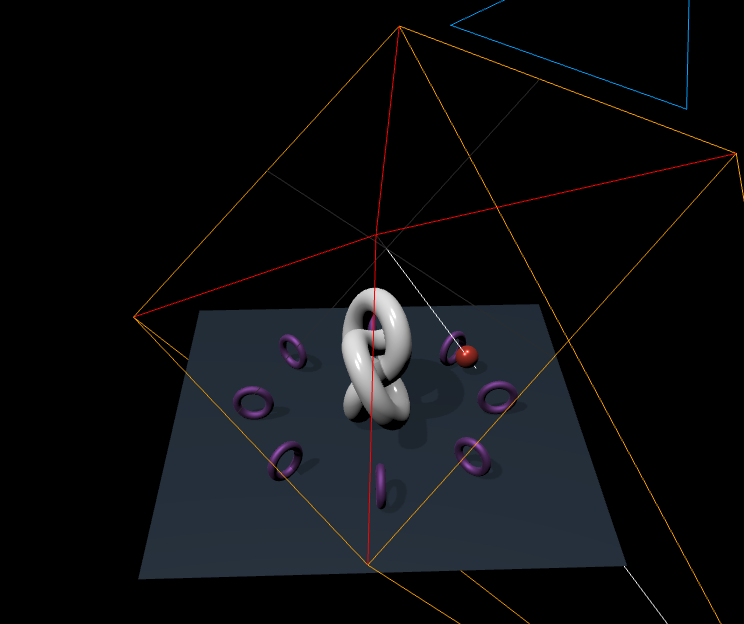
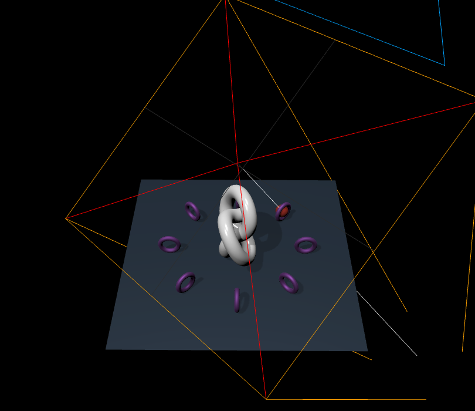
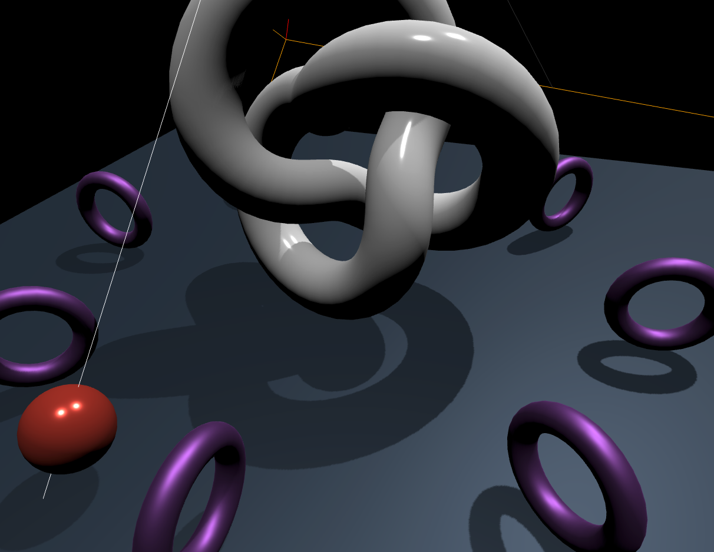
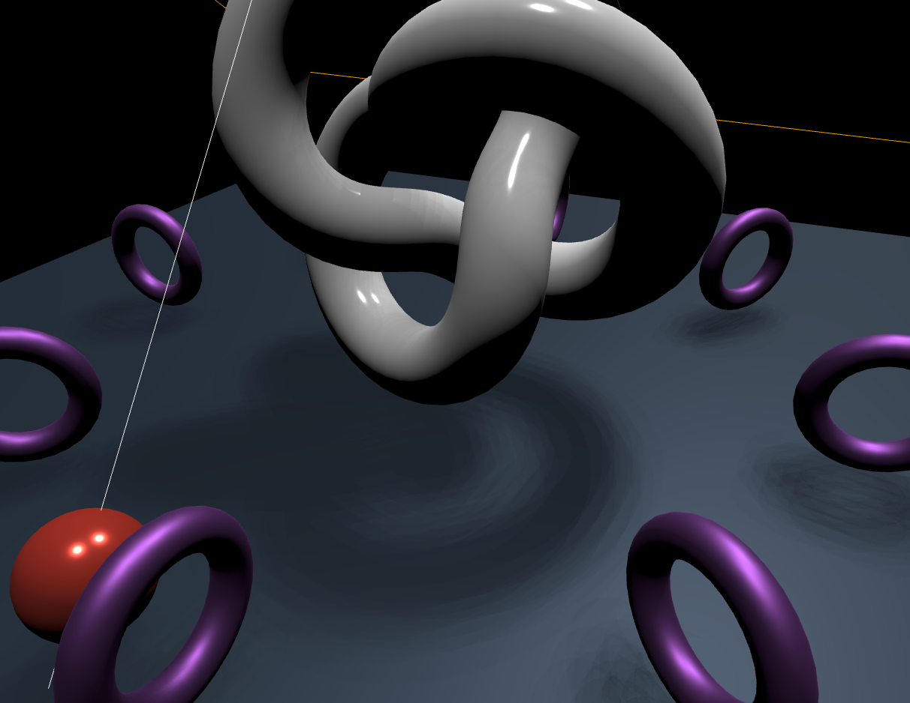
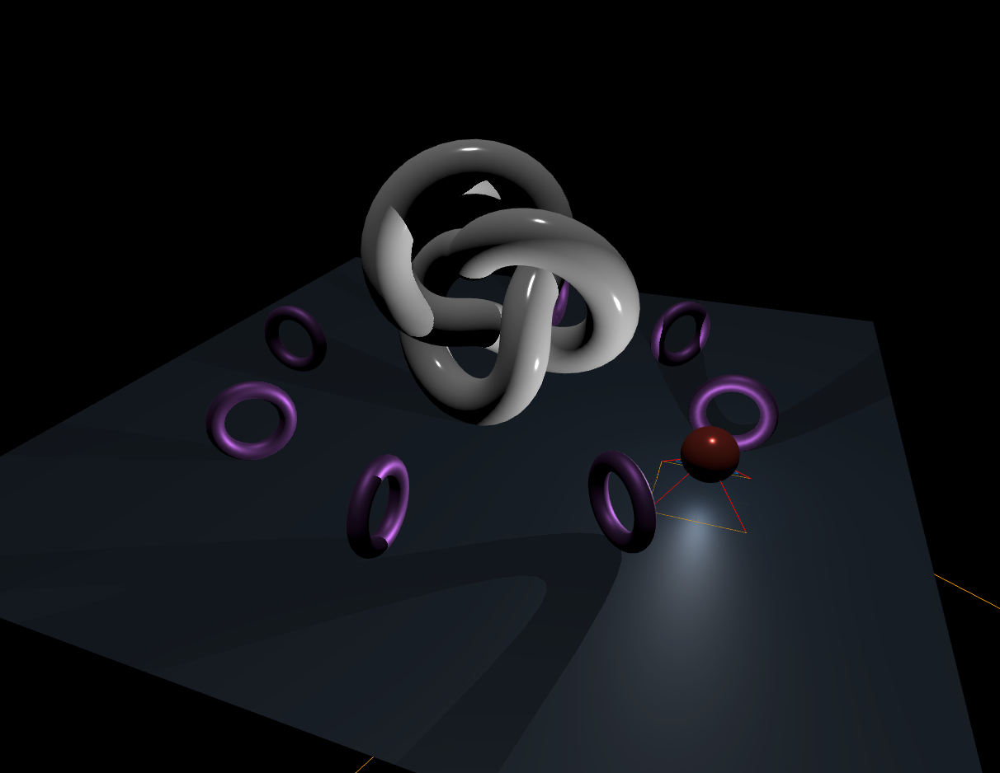
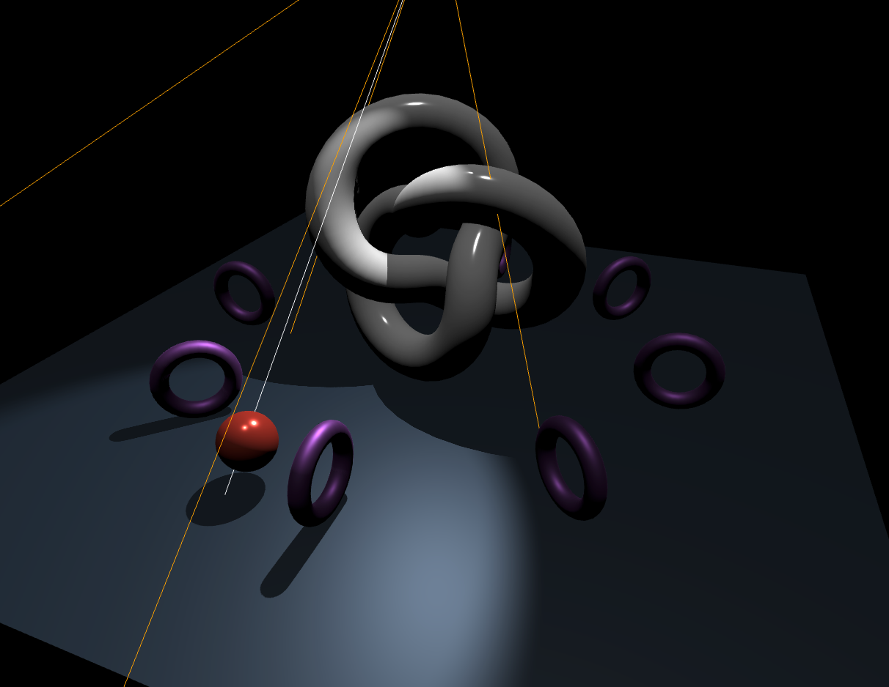

# 9강 그림자

three.js는 동적으로 그림자를 렌더링 할 수 있다.

내부적으로 텍스쳐 맵핑을 통해 그림자를 위한 이미지를 생성하고, 이 이미지를 이용해 그림자를 시각화 해보자.

## 그림자를 렌더링하기 위한  세 가지 객체 설정

### 1. Renderer 객체

```jsx
renderer.shadowMap.enabled = true
```

### 2. 광원

#### 그림자를 제공하는 광원

- DirectionalLight
- PointLight
- SpotLight

이 광원들은 모두 `shadow.camera` 속성을 갖는다.

이 속성이 그림자에 대한 텍스쳐 이미지를 생성하는 데 사용된다.

그림자를 줄 것인지에 대한 여부를 다음처럼 설정할 수 있다.

```jsx
light.castShadow = true;  // 활성화
```

### 3. 모델

그림자를 표현하는 모델에 다음 코드를 추가한다.

```jsx
mesh.receiveShadow = true; // 그림자를 받아서 표현하는 모델
mesh.castShadow = true; // 그림자를 다른 객체에 주는 모델
```

## DirectionalLight의 그림자

### shadow.camera 설정

DirectionalLight의 그림자를 위한 카메라는 **OrthographicCamera**

⇒ 카메라의 절두체를 벗어나는 그림자가 짤리게 된다.

> 그림자가 절두체를 벗어나 짤리는 것을 방지하기 위해 카메라의 절두체를 그림자가 지나는 위치보다 크게 설정해주어야 한다.
> 

```jsx
light.shadow.camera.top = light.shadow.camera.right = 6;
light.shadow.camera.bottom = light.shadow.camera.left = -6;
```

기본으로 설정했을 때 절두체를 벗어남


절두체를 크게 설정했을 때


### 그림자의 품질 향상시키기

그림자는 텍스쳐 맵핑 이미지를 이용해 표현된다.

텍스쳐 맵핑 이미지의 디폴트 크기는 512 * 512인데, 이 크기를 크게 할 수록 품질이 향상된다.

### 그림자의 경계 블러링 처리하기

shadow.radius: 값이 클수록 블러링 효과가 강해진다. (기본값: 1)

```jsx
light.shadow.radius = 30;
```

기본값일 때 (1)


크게 설정 했을 때 (30)


## PointLight의 그림자

사방으로 빛을 던지는 광원이므로 그에 맞게 그림자가 퍼지는 것을 확인 할 수 있다.



## SpotLight의 그림자

