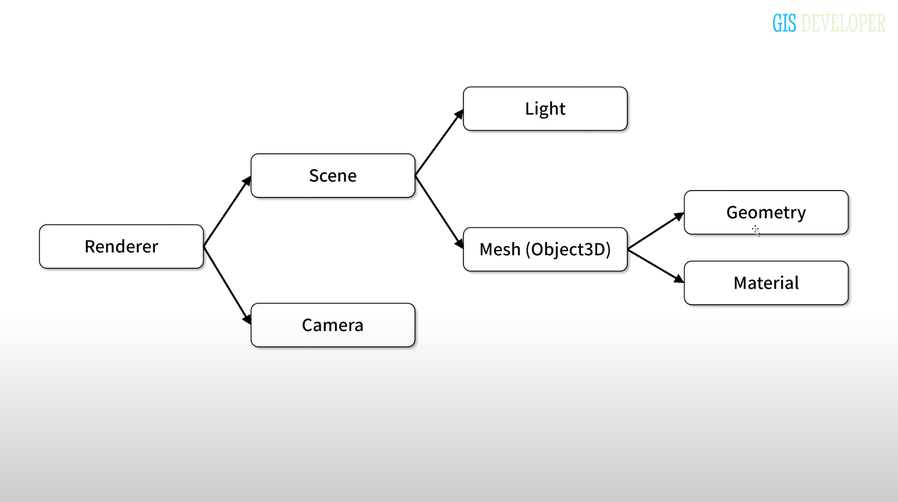

# 1주차 공부내용 정리

## 개발환경세팅

3d 스터디 프론트엔드 파트는 3명이고 스터디 진행 방식이 각자 예제 코드를 작성해보는 것이었다.

예제 코드는 이미 build된 three.js 파일을 다운로드 받고, 프로젝트 내에 minify된 three.js 파일을 추가해서 import 해서 사용하는데, 이건 좀 아쉽다는 생각이 들어서 개발환경 세팅을 해보기로 했다.

팀원들 각각의 example 폴더에 소스코드를 작성하기로 했고, 이 폴더가 서로 관련 없이 따로 관리되는 경우 라이브러리가 중복되어서 다운로드 받아질 것이기 때문에 중복 인스톨을 방지할 차원에서, 또 팀원 각자가 원하는 세팅이 있을수도 있기 때문에(번들링 툴을 바꾼다던가 등등) 각자의 개발환경을 분리해줄 수 있는 방법이 없을까 하다가 yarn이 제공하는 workspace라는 개념을 알게되었다.

모놀리식 레포, 멀티레포, 모노레포 등 이런 개념을 어디선가 접했었는데, workspace가 여기에 관련된 내용이라고 해서 설정을 하면서 조금 더 공부해보는 기회가 있었는데 이건 따로 정리해야할것같아서 패스!

### 공식문서를보자

[https://yarnpkg.com/features/workspaces](https://yarnpkg.com/features/workspaces)

[https://yarnpkg.com/features/pnp](https://yarnpkg.com/features/pnp)

### yarn workspace 사용, 개발환경 분리

- 프로젝트 초기화
  `yarn init -y`
  `yarn set version berry`
- 루트 프로젝트의 package.json에 workspace 추가
  ```json
  // ./package.json
  {
    "name": "22nd-3d-study",
    "packageManager": "yarn@3.5.1",
    "workspaces": [
      "packages/*", //폴더 경로 입력, 입력된 경로 모두 워크스페이스로 간주된다
      "sangjun/example*",
  		"hayoung/example*",
  		"ahyeon/example*"
    ]
  	"private":true //npm에 게시하지 않음
  }
  ```
- 워크스페이스 package.json 설정

  ```json
  // ./sangjun/example/package.json
  {
  	"name":"sangjun", //워크스페이스는 name으로 구분된다.

  	...

  	"devDependencies": {
      "css-loader": "^6.7.4",
      "pnp-webpack-plugin": "^1.7.0",
      "style-loader": "^3.3.3",
      "ts-loader": "^9.4.3",
      "typescript": "^4.7.4",
      "webpack": "^5.83.1",
      "webpack-cli": "^5.1.1",
      "webpack-dev-server": "^4.15.0"
    },
    "dependencies": {
      "@types/three": "^0.152.0",
      "three": "^0.152.2"
    }
  }
  ```

- 워크스페이스 명령어
  `yarn workspace <workspaceName> <command>`

### pnp 설정하기

[https://yarnpkg.com/features/pnp](https://yarnpkg.com/features/pnp)

- .gitignore 설정
  ```yaml
  !.yarn/cache
  # yarn 부터는 pnp가 기본이고, node_modules가 아닌 cache에 라이브러리가 설치됨(
  #.pnp.*  # node_modules 대신 모듈을 매핑해주는 pnp를 꼭 git에 추가해주어야 한다.
  ```
- nodeLineker 수정
  ```yaml
  # .yarnrc.yml
  nodeLinker: pnp
  ```
  이후 yarn install할 경우 .pnp.cjs 파일이 생성된다.

### typescript + pnp설정

- 같은 타입스크립트 옵션 설정하기
  레포지토리 내의 다른 워크스페이스들에게 같은 타입스크립트 설정을 해주려면 extends 활용
  ```jsx
  {
    "extends": "../../tsconfig.json", //루트 폴더의 tsconfig.json을 extends한다
    "compilerOptions": {
      "rootDir": "./src"
    },
    "include": ["src"]
  }
  ```
- vscode에서 타입스크립트 pnp 설정
  [https://yarnpkg.com/getting-started/editor-sdks](https://yarnpkg.com/getting-started/editor-sdks)
  `yarn dlx @yarnpkg/sdks vscode`
  이렇게하면 루트폴더의 .vscode에 settings.json 파일이 생긴다.
  ```json
  //settings.json
  {
    "search.exclude": {
      "**/.yarn": true,
      "**/.pnp.*": true
    },
    "typescript.tsdk": ".yarn/sdks/typescript/lib",
    "typescript.enablePromptUseWorkspaceTsdk": true
  }
  ```

### yarn pnp와 webpack

- 웹팩관련 패키지 인스톨
  프로덕션 패키지에는 필요없으므로 dev 종속성으로 인스톨 한다.
  `yarn -D webpack webpack-cli webpack-dev-server`
- 기분좋은소식
  [https://webpack.kr/migrate/5/#clean-up-configuration](https://webpack.kr/migrate/5/#clean-up-configuration)
  > Yarn의 PnP 및 `pnp-webpack-plugin`을 사용하는 경우 좋은 소식이 있습니다. 이제 기본적으로 지원됩니다. 설정에서 제거해야 합니다.
  > 웹팩 설정 할 때 pnp-webpack-plugin 라이브러리만 설치해주면 따로 설정해주지 않아도 자동으로 pnp 패키지를 인식한다.
- webpack 기본 설정

  ```jsx
  const path = require("path");

  module.exports = {
    entry: "./src/main.ts", // 웹팩 번들링 시작점.
    output: {
      filename: "./main.js", //webpack build 시 아웃풋 파일 이름
      path: path.resolve(__dirname, "public"), // ./public/main.js로 번들링된다.
    },
    module: {
      rules: [
        {
          test: /\.css$/,
          use: ["style-loader", "css-loader"], //css 파일 번들링에 필요
        },
        {
          test: /\.ts/,
          use: "ts-loader", //ts 파일 번들링에 필요
        },
      ],
    },
    devServer: {
      static: {
        directory: path.join(__dirname, "public"), // 개발 서버는 ./public/index.html을 참조
      },
      compress: true,
      port: 3000,
    },
    resolve: {
      extensions: [".tsx", ".ts", ".js"],
    },
  };
  ```

## Three.js 기본 구성 요소 정리



### 기본 구성 요소

- Renderer - 씬을 모니터 장치에 출력할 수 있게 해줌
  - Camera - 카메라 시점 정의
  - Scene - 3차원 객체, 씬
    - Light - 빛 화면에 적절히 표현되기 위해 광원이 필요함
    - Mesh(Object3D)
      - Geometry - 형상 정의
      - Metarial - 색상 및 투명도

### 그 외에 내용들

**THREE.WebGLRenderer**({ antialias: true })

- 랜더러 : 만들어진 Scene을 WebGL에 화면에 그려준다
- renderer.domElement에 그려지는 캔버스 엘리먼트가 있음, appendChild로 돔에 추가를 해주어야 한다.
- renderer.render 메서드로 실제 캔버스에 랜더링을 해줌, requestAnimationFrame을 활용해서 랜더링
  - render 메서드의 첫번째 파라미터에는 time 값이 넘어온다.

**Scene**

- 렌더링할 내용과 위치를 설정할 수 있는곳 여기에 Mesh, Light 및 Camera를 배치함.
