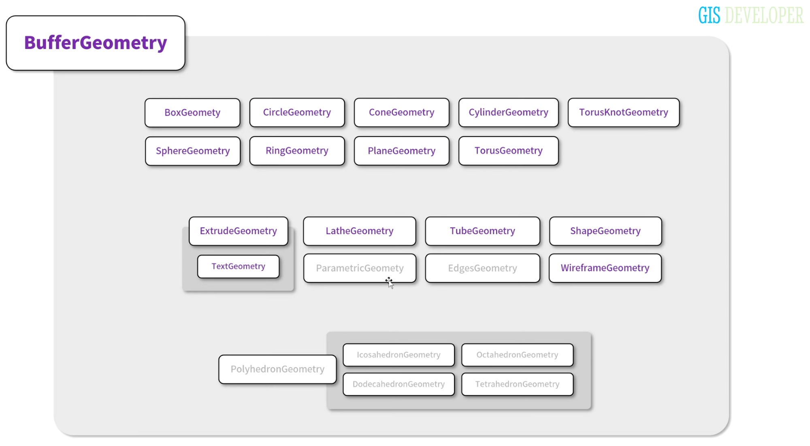

# 2주차 공부

# 기본 Geometry 살펴보기

강좌에서는 자주색으로 색칠된 지오메트리만 다룰예정

- 다루지 않는 geometry 짚고가기

  ParametricGeometry : 수학적 함수식에 두개의 값을 입력하여 얻을 수 있는 좌표로 구성되는 지오메트리

  EdgesGeometry : Geometry를 이루는 인접면의 각도에 따라 Geometry 재구성

  PolyhedronGeometry : 다면체를 구성하는 지오메트리

  Icoshedron : 20면체

  Octahedron : 8면체

  Dodeceahedron:12면체

  Tetahedron : 4면체

## Geometry 구성요소

> geometry는 형상을 정의한다

- 형상을 정의하기 위해 필요한 데이터
  | 종류 | 설명 |
  | -------------------------- | ------------------------------------------------------------ |
  | Vertex (정점) | 형상을 정의, X,Y,Z축에 대한 좌표, 3차원 오브젝트의 면을 구성 |
  | Vertex Index (정점 인덱스) | 정점에 대한 인덱스 |
  | Normal Vector (수직 벡터) | 정점에 대한 수직벡터 |
  | Vertext Color (정점 색상) | 정점 색상 |
  | UV 좌표 | 텍스쳐 매핑에 사용 |
  | 사용자 정의 데이터 | 사용자가 임의로 정의한 데이터가 포함될 수 있다. |
  3차원으로 시각화 될 때 GPU로 전달되어, 한번에 랜더링됨

# Geometry 예제

> src/example/week2/geometry에 작성
