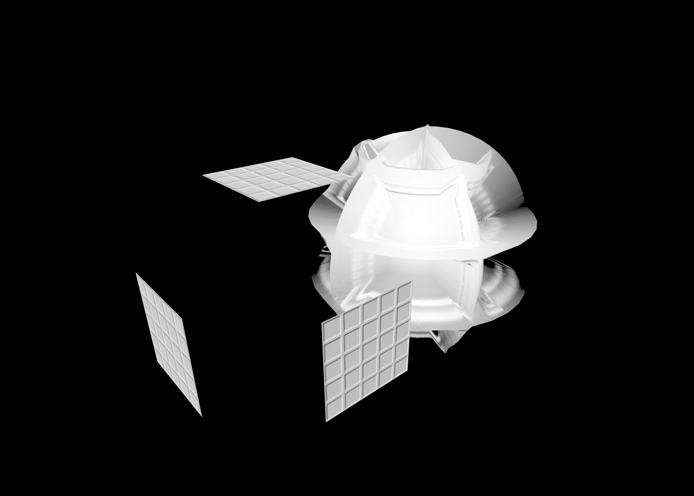

# [3d스터디]

날짜: 2023년 6월 22일

# #매핑 속성 2주차

### normalMap

각 좌표의 노말벡터를 이용해서 보간됨

노말맵을 사용하게 되면 박스 표면의 노말벡터를 노말맵 이미지의 rgb값을 이용하여 계산하게됨

인위적으로 매쉬 표면의 각 픽셀에 대해 법선 벡터를 지정할 수 있게 되고 각 픽셀단위로

광원효과가 달라져 입체감을 표현할수 있게됨

### displacementMap



?????

실제 지오메트리의 구성 좌표를 변경하여 입체감을 표현함

맵 이미지의 픽셀값이 밝을수록 좌표의 변이가 발생

- 너무 과장되어 변위가 일어나니 displacementScale, displacementBias로 조정 가능


### 실제로 box는 변위가 일어나지 않는다 왜??

박스의 표면에 대한 구성좌표가 제공되어야 변위가 일어나난다.

박스의 지오메트리 표면을 여러개의 면으로 분할시켜주어야 함.

```tsx
const box = new THREE.Mesh(new THREE.BoxGeometry(1, 1, 1,**256,256,256),** metarial);
    box.position.set(-1, 0, 0);
    this.scene.add(box);
```


오…

분할하는 좌표수에 따라 랜더링 이슈가 발생할 수 있으니, 적당히 조절해야 한다

### aoMap

aoMap 적용을 위해 두가지가 필요

- ambientLight : 모든 mesh에 대해 균일하게 비추는 광원, 추후 광원파트에서 다룰 예정9
  ```tsx
  setUpLight() {
      const ambientLight = new THREE.AmbientLight(0xffffff,0.2);
      this.scene.add(ambientLight);
  	...
  }
  ```
- geometry의 uv 데이터
  ```tsx
  box.geometry.attributes.uv2 = box.geometry.attributes.uv;
  sphere.geometry.attributes.uv2 = sphere.geometry.attributes.uv;
  ```


uv 지정 전


uv 지정 이후

aoMap을 사용하면 미리 만들어진 세밀한 그림자와 같은 느낌의 효과를 지정할 수 있다

### 이전에 지정한 속성을 모두 적용하면

```tsx
const metarial = new THREE.MeshStandardMaterial({
      map:map
      normalMap: mapNormal,
      displacementMap: mapHeight,
      displacementBias: -0.15,
      displacementScale: 0.2,
      aoMap: mapAO,
      aoMapIntensity: 2,
    });
```


### Roughness


roughness 없음


roughness 0.1


roughness 1

Roughness 적용시 표면에 거칠기 표현이 가능,

숫자가 작으면 반짝거리는 플라스틱 느낌이 난다

### metalnees


금속효과가 난다

### alphaMap

이미지의 픽셀값이 밝을수록 투명하게 만듬

```tsx
const metarial = new THREE.MeshStandardMaterial({
      ...
      alphaMap: mapAlpha,
      transparent: true, //투명 속성 사용 필요
			side:THREE.DoubleSide // 안쪽 면도 랜더링 하려면 사용
    });
```


적용전


적용후

### lightMap

지정된 이미지의 색상으로 발광하는 느낌을 표현할 수 있다

다음과 같은 이미지 사용.

```tsx
const mapLight = textureLoader.load("images/glass/light.jpg");

const metarial = new THREE.MeshStandardMaterial({
			...
 	     // alphaMap
			lightMap : mapLight;
      lightMapIntensity:1 // 이 값으로 빛을 조절
    });

//uv값 또한 필요하다.
box.geometry.attributes.uv2 = box.geometry.attributes.uv;
sphere.geometry.attributes.uv2 = sphere.geometry.attributes.uv;
```


mapLight라는 텍스쳐를 추가,


이런 효과가 난다

# #6 사용자 정의 지오메트리

사용자가 원하는 지오메트리를 생성해서 사용할 수 있다

### BufferGeometry에 대해 지정해줄수 있는 속성들


- position : geometry를 구성하는 3차원 좌표에 대한 정점
- color: 각 정점에 대한 색상값
- normal: 각 정점에 대한 수직벡터
- uv:각 정점에 대한 텍스쳐 매핑좌표
- Vertext Index: 포지션 속성으로 지정된 정점에 대한 인덱스 배열
  mesh 기본 단위는 삼각형이고, 삼각형은 3개의 정점으로 구성, 이 삼각형을 구성하는 3개의 정점에 대한 position 속성에서의 인덱스 번호를 의미

### 간단한 Geometry로 각각의 속성 살펴보기


```tsx
setUpModel() {
    const rawPositions = [-1, -1, 0, 1, -1, 0, -1, 1, 0, 1, 1, 0];
    const positions = new Float32Array(rawPositions);
    const geometry = new BufferGeometry();
    //두번째 인자, 하나의 정점이 3개의 항목(x,y,z)로 이루어진다
    geometry.setAttribute("position", new THREE.BufferAttribute(positions, 3)); }
```

### VertextIndex

정점의 배치순서는 반시계 방향이어야 한다

반시계 방향인 면이 앞면이므로 주의!

```tsx
geometry.setIndex([0, 1, 2, 2, 1, 3]);
const metarial = new THREE.MeshPhongMaterial({ color: 0xff0000 });

const box = new Mesh(geometry, metarial);
this.scene.add(box);
```

- 법선 벡터 필요
  광원이 mesh의 표면에 비추는 입사각과 반사각을 계산하여 재질과함께 표면의 색상을 결정하는데 사용

  ```tsx
  geometry.computeVertexNormals(); // 알아서 계산

  // 직접 법선벡터 지정
  const rawNormals = [0, 0, 1, 0, 0, 1, 0, 0, 1, 0, 0, 1];

  const positions = new Float32Array(rawPositions);
  const normals = new Float32Array(rawNormals);
  ```

- vertexNormalsHelper 추가


### 정점에 대한 색상값 추가

```tsx
const rawPositions = [-1, -1, 0, 1, -1, 0, -1, 1, 0, 1, 1, 0];
const positions = new Float32Array(rawPositions);
const rawNormals = [0, 0, 1, 0, 0, 1, 0, 0, 1, 0, 0, 1];
const normals = new Float32Array(rawNormals);
const rawColors = [1, 0, 0, 0, 1, 0, 0, 0, 1, 1, 1, 0]; //color 값 생성
const colors = new Float32Array(rawColors);

const geometry = new BufferGeometry();
geometry.setAttribute("position", new THREE.BufferAttribute(positions, 3));
geometry.setAttribute("normal", new THREE.BufferAttribute(normals, 3));
geometry.setAttribute("color", new THREE.BufferAttribute(colors, 3)); // 값 추가

geometry.setIndex([0, 1, 2, 2, 1, 3]);

geometry.computeVertexNormals();
const metarial = new THREE.MeshPhongMaterial({
  color: 0xff0000,
  vertexColors: true, //사용 설정
});
```


vertex 고유색상을 사용하기위해 다음과같이 색상 변경

```tsx
const metarial = new THREE.MeshPhongMaterial({
  color: 0xffffff,
  vertexColors: true,
});
```


### UV 속성

```tsx
const rawPositions = [-1, -1, 0, 1, -1, 0, -1, 1, 0, 1, 1, 0];
const positions = new Float32Array(rawPositions);
const rawNormals = [0, 0, 1, 0, 0, 1, 0, 0, 1, 0, 0, 1];
const normals = new Float32Array(rawNormals);
const rawColors = [1, 0, 0, 0, 1, 0, 0, 0, 1, 1, 1, 0];
const colors = new Float32Array(rawColors);
const rawUVs = [0, 0, 1, 0, 0, 1, 1, 1];
const uvs = new Float32Array(rawUVs);

const geometry = new BufferGeometry();
geometry.setAttribute("position", new THREE.BufferAttribute(positions, 3));
geometry.setAttribute("normal", new THREE.BufferAttribute(normals, 3));
geometry.setAttribute("color", new THREE.BufferAttribute(colors, 3));
geometry.setAttribute("uv", new THREE.BufferAttribute(uvs, 2));

geometry.setIndex([0, 1, 2, 2, 1, 3]);

const textureloader = new TextureLoader();
const map = textureloader.load("./images.jpeg");

const metarial = new THREE.MeshPhongMaterial({
  color: 0xffffff,
  vertexColors: true,
  map,
});
```


버텍스 색생과 텍스쳐 색상이 같이 랜더링


텍스쳐만 매핑

- uv 좌표 매핑방식

```tsx
const rawPositions = [
  -1,
  -1,
  0, // --- (1)
  1,
  -1,
  0, // --- (2)
  -1,
  1,
  0, // --- (3)
  1,
  1,
  0, // --- (4)
];

const rawUVs = [
  0,
  0, // --- (1) 좌측하단
  1,
  0, // --- (2) 우측하단
  0,
  1, // --- (3) 좌측상단
  1,
  1, // --- (4) 우측상단
];
```

# #7 광원

## Three.js에서 Light의 종류


- 주변광
  AmbientLight
  HemishpereLight
- 빛의 방향성을 가지는 광원
  DirectionalLight
  PointLight
  SpotLight
  RectAreaLight

### AmbientLight

```tsx
const light = new AmbientLight(0xffffff, 5);
```

색상값과, 세기값을 받아서 씬에 존제하는 모든 물체에 대해 단일 색상으로 랜더링 되도록함


### HemitSphereLight

```tsx
const light = new HemisphereLight("#b0d8f5", "#bba7a1c", 2);
```

AmbientLight와 비슷하지만, 위에서 비치는 색상과 아래에서 비치는 색상값을 받는다


미묘하게 그라데이션 생긴것을 볼수있다

### DirectionalLight

```tsx
const light = new DirectionalLight(0xffffff, 1);
light.position.set(0, 5, 0);
light.target.position.set(0, 0, 0);
```


광원의 위치, 광원이 비추는 위치를 세팅 해주어야 한다.

빛과 물체간의 거리에 상관없이 동일한 빛의 효과를 준다

빛의 position과 타겟 속성의 position으로 결정되는 방향만이 의미가 있다

### PointLight

광원의 위치에서 사방으로 퍼져나가는 빛

```tsx
// PointLight
const light = new PointLight(0xffffff, 2);
light.position.set(0, 5, 0);

// 지정된 거리까지만 빛이 닿도록 할 수 있음
//light.distance = 1

const helper = new PointLightHelper(light);
this.scene.add(helper);
```


### SpotLight

빛이 깔대기 모양으로 퍼짐

```tsx
const light = new SpotLight(0xffffff, 1);
light.position.set(0, 5, 0);
light.target.position.set(0, 0, 0);
light.angle = MathUtils.degToRad(40); // 깔때기 각도
light.penumbra = 0; //빛의 감쇄율
this.scene.add(light.target);
const helper = new SpotLightHelper(light);
this.scene.add(helper);
```


PlaneObjet인 바닥이 원형만 보이는걸 알수 있다.

- light.target을 작은 구에 맞추면

```tsx
if (this.light instanceof SpotLight && this.light?.target) {
  const smallSphere = smallSpherePivot.children[0];
  smallSphere.getWorldPosition(this.light.target.position);
  if (this.lightHelper) this.lightHelper.update();
}
z;
```


### AreaLight

형광등, 창문에서 들어오는 광원

```tsx
// 인자로 받는값 (색상,intensity, 높이, 길이)
const light = new RectAreaLight(0xffffff, 10, 3, 0.5);
```


광원의 세기, 광원의 크기, 등이 물체에 모두 영향을 준다.

광원의 target을 저장하는게 아니라, deg를 설정해서 사용한다

보통 하나의 Light를 사용하는게 아니라 여러개의 light를 합쳐서 사실적으로 표현하려고 한다.
