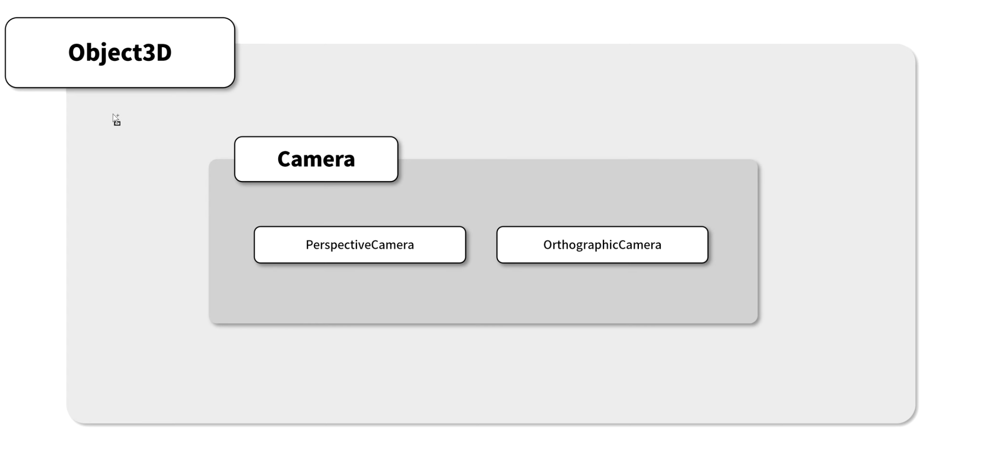

# [3d스터디]

날짜: 2023년 7월 1일

# #8 카메라

## three.js에서 제공하는 카메라




- Perspective Projection
  원근감 있게 보여주는 카메라
- Orthographic Projection
  물체간의 거리감이 없이 크기대로 랜더링됨

### perspective Camera


- 4개의 인자값을 알아야 한다
  연두색으로 보이는 육면체를 절두체라고 함
  절두체 안에 있는 물체만 화면상에 랜더링 됨
  - fovy : 절두체의 높이 방향에 대한 각도
  - aspect : 절두체의 가로 길이를 세로 길이로 나눈 비율
  - zNear : 카메라로부터의 거리,
  - zFar : 카메라로부터의 거리,
    → zFar과 zNear 사이에 존재하는 물체 일부만 랜더링됨, 벗어나면 랜더링되지 않는다.
- Three.js 코드에서 살펴보기

  - PerspectiveCamera 인스턴스 생성하기
    ```tsx
    const camera = new THREE.PerspectiveCamera(
      75, // fovy : 단위는 degree
      width / height, // aspect : 이전까지 실습한 값은 dom요소의 가로, 세로값의 비율로 사용
      0.1, // zNear
      100
    ); //zFar
    ```
  - 카메라 속성을 업데이트 할 때는 updateProjectionMatrix() 사용
    ```tsx
    // 리사이즈 이후, width height 가져오기
    const { clientWidth: width, clientHeight: height } = this.divContainer;

    // 카메라 속성값 설정,
    this.camera.aspect = width / height;
    this.camera.updateProjectionMatrix(); //업데이트!
    ```

- zNear와 zFar 사이에 있는 물체만 랜더링 된다.
  - zNear값을 올린 경우
    
    zNear값보다 가까운 부분은 랜더링되지 않음.

### Orthographic Camera


- 물체를 원근감 없이 랜더링,
- 파란색 직육면체를 랜더링 하기 위해 6개의 파라미터 필요함.

  파란 직육면체의 중심을 기준으로 했을때

  - xLeft / xRight : 수평 축에 대한 좌표값
  - yTop / yBottom : 수직 축에 대한 좌표값
  - zNear / zFar : perspectiveCamera와 동일,

- Three.js 코드에서 살펴보기
  ```tsx
  const aspect = width / height;
  const camera = new THREE.OrthographicCamera(
    -10 * aspect, // xLeft
    10 * aspect, // xRight
    10, // yTop
    -10, // yBottom
    0.1, // zNear
    100 // zFar
  );
  ```
  - xLeft와 xRight에 aspect 곱하는 이유?
    DOM 요소의 비율과 랜더링 화면의 비율을 맞추기 위해 곱하는것

### Resize

- 각 카메라에 맞게 aspect를 적용해줌으로써 비율을 맞춰줄 수 있다.
  ```tsx
  resize() {
      const { clientWidth: width, clientHeight: height } = this.divContainer;
      const aspect = width / height;

      if (this.camera instanceof THREE.PerspectiveCamera) {
        this.camera.aspect = aspect;
      }
      // 카메라 속성값 설정,
      else {
        this.camera.left = -10 * aspect;
        this.camera.right = 10 * aspect;
      }

      //랜더러 사이즈 설정
      this.camera.updateProjectionMatrix();
      this.renderer.setSize(width, height);
    }
  ```

## Camera 시점 바꾸기

```tsx
update(time: number) {
    time *= 0.001;
    const smallSpherePivot = this.scene.getObjectByName("smallSpherePivot"); //빨간 구
    const targetPivot = this.scene.getObjectByName("targetPivot"); // 추가한 시점
    if (!smallSpherePivot) return;
    if (!targetPivot) return;

    smallSpherePivot.rotation.y = MathUtils.degToRad(time * 50);
    targetPivot.rotation.y = MathUtils.degToRad(time * 50 + 10); //빨간색 구 이동 위치보다 10도 앞에 위치,

    const smallSphere = smallSpherePivot.children[0];
    smallSphere.getWorldPosition(this.camera.position);

    const target = targetPivot.children[0];
    target.getWorldPosition(pt); // 시점에 대해 좌표 설정

    this.camera.lookAt(pt); // 카메라가 10도 앞선 타겟을 바라보도록 함.

    if (this.light instanceof SpotLight && this.light?.target) {
      smallSphere.getWorldPosition(this.light.target.position);
      if (this.lightHelper) this.lightHelper.update();
    }
  }
```


공의 시점에서 고리를 통과한다.

# #9 그림자

그림자를 랜더링하기 위해서는 3가지 객체에 대한 설정이 필요하다

- 랜더러
  ```tsx
  renderer.shadowMap.enabled = true;
  ```
- 광원
  ```tsx
  light.castShadow = true;
  ```
- 모델
  ```tsx
  // ground: 바닥부분, 그림자를 받아서 표현함.
  ground.receiveShadow = true;

  // centerTorusknot : 중앙의 torusknot, 그림자를 받기도 주기도 함
  centerTorusKnot.castShadow = true;
  centerTorusKnot.receiveShadow = true;

  // torus, smallSphere 모두 castShadow, receiveShadow 적용
  ```

### 그림자의 끊김 현상


우측에 토러스 두개의 그림자가 끊겨있는것을 볼수 있다.

### light.shadow.camera

light가 그림자를 생성하기 위해서는 camera를 사용한다.

shadow의 카메라 절두체에 물체가 없는 경우, 그림자가 짤리게 되는것


절두체의 크기를 크게 해주면, 그림자가 잘리지 않고 생성된다

```tsx
light.shadow.camera.top = 6;
light.shadow.camera.bottom = -6;
light.shadow.camera.right = 6;
light.shadow.camera.left = -6;
```


### 그림자의 품질 올리기

그림자는 텍스쳐 매핑에 의해 생성된다.

```tsx
light.shadow.mapSize.width = 2048;
light.shadow.mapSize.height = 2048;
```


### 그림자의 외각 블러 처리

```tsx
light.shadow.radius = 10;
```


